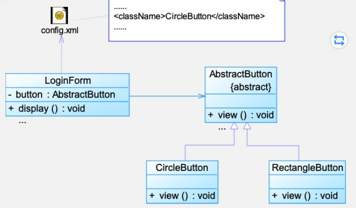
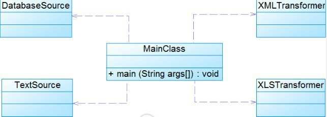
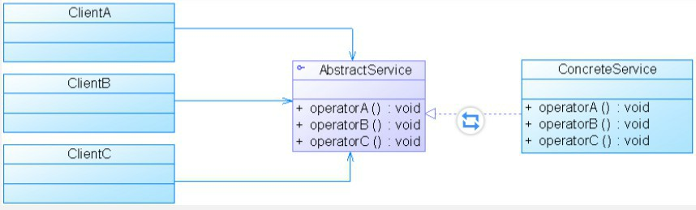
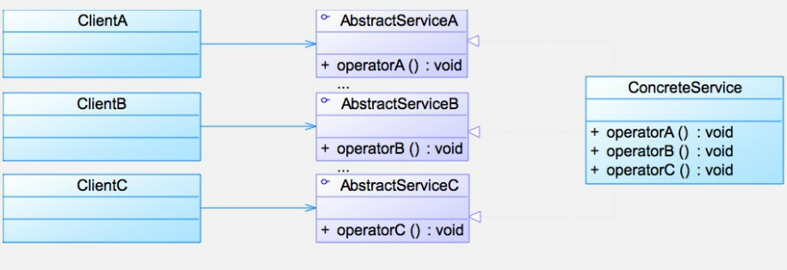
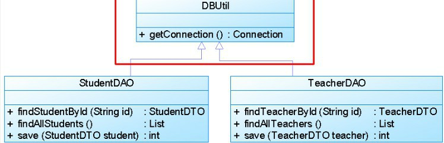
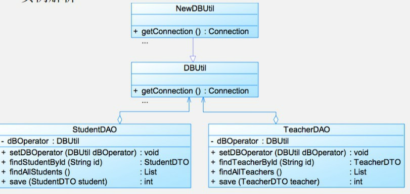

# 来源

来自nju软设笔记+各种博客+自己理解

博客：

https://blog.csdn.net/zhjali123/article/details/103091236

https://blog.csdn.net/hyo555/article/details/80293960

https://www.runoob.com/design-pattern/front-controller-pattern.html

# 概念

## **软件模式**

软件模式是将模式的一般概念应用于软件开发领域，即**软件开发的总体指导思路或参照样板**。软件模式并非仅限于设计模式，还包括架构模式、分析模式和过程模式等，实际上，**在软件生存期的每一个阶段都存在着一些被认同的模式**。

> 要是不从 架构设计 -> 设计模式 来考虑一定是失败的


软件模式可以认为是**对软件开发这一特定“问题”的“解法”的某种统一表示**，**软件模式等于一定条件下的出现的问题以及解法**。软件模式的基础结构由4个部分构成：**问题描述、前提条件（环境或约束条件）、解法和效果。**

软件模式与具体的应用领域无关，在模式发现过程中需要遵循**大三律(Rule of Three)**，即**只有经过三个以上不同类型（或不同领域）的系统的校验**，一个解决方案才能从候选模式升格为模式.

**分类:**

- 架构模式:系统级别,更高层级的抽象
- 设计模式:业务级别的抽象

**设计模式与架构模式的区别**

架构模式（Architecture Pattern）内可以用设计模式（Design Pattern），但设计模式内无法用架构模式。

> 比如MVC、微服务、点对点、事件驱动架构是架构设计
>
> MVC架构模式
>
> Model
> 可以采用代理模式设计，data source（在Local端代理Remote(远端)的服务，比如ContentProvider，跨进程索引数据，通过本进程的）
> 数据库连接时的桥接模式
> 获取服务器数据流的 装饰者模式
> MVC的架构VC层可以用 观察者模式 进行分发事件
> View层，View与ViewGroup的 组合者模式，ListView的数据接口绑定的适配器模式

## 设计模式

设计模式一般有如下几个基本要素：**模式名称、问题、目的、解决方案、效果、实例代码和相关设计模式**, 关键点仍然是软件模式的关键点:

**问题描述、前提条件（环境或约束条件）、解法和效果。**

## **设计模式分类方式（重点）**

**按目的分类**（模式是用来做什么的）:

- 创建型模式主要用于**创建对象**。

- 结构型模式主要用于**处理类或对象的组合**。
- 行为型模式主要用于**描述对类或对象怎样交互和怎样分配职责**。

**按范围分类**(模式主要是用于处理类之间关系还是处理对象之间的关系)

- 类模式: 类模式**处理类和子类之间的关系**，这些关系通过继承建立，在编译时刻就被确定下来，是属于**静态**的。
- 对象模式: 对象模式**处理对象间的关系**，这些关系在运行时刻变化，更具**动态**性。

| 范围\目的 | 创建型模式                                   | 结构型模式                                                   | 行为型模式                                                   |
| --------- | -------------------------------------------- | ------------------------------------------------------------ | ------------------------------------------------------------ |
| 类模式    | 工厂方法模式                                 | （类）适配器模式                                             | 模板方法模式                                                 |
| 对象模式  | 抽象工厂模式、建造者模式、原型模式、单例模式 | （对象）适配器模式、桥接模式、组合模式、装饰模式、外观模式、享元模式、代理模式 | 命令模式、迭代器模式、中介者模式、观察者模式、状态模式、策略模式 |

### 内聚和耦合

耦合（程度从高到低）

1. 内容耦合：一个模块直接访问另一模块的内容，则称这两个模块为内容耦合。

   - 一个模块直接访问另一个模块的内部数据、一个模块不通过正常入口而直接转入到另一个模块的内部、两个模块有一部分代码重叠（该部分代码具有一定的独立功能）、一个模块有多个入口代表出现内容耦合

     > 对于使用高级语言软件开发应该完全杜绝内容耦合的出现

2. 公共耦合：一组模块都访问同一个全局数据结构，则称之为公共耦合。公共数据环境可以是全局数据结构、共享的通信区、内存的公共覆盖区等。

   - 无法控制各个模块对公共数据的存取，严重影响了软件模块的可靠性和适应性。
   - 降低了软件的可理解性。不容易清楚知道哪些数据被哪些模块所共享，排错困难。

3. 外部耦合：一组模块都访问同一全局简单变量，而且**不通过参数表**传递该全局变量的信息，则称之为外部耦合。

   > 弱化版的公共耦合，共享的是一个简单变量而不是数据结构

4. 控制耦合：模块之间传递的不是数据信息，而是控制信息例如标志、开关量等，一个模块控制了另一个模块的功能。

5. 标记耦合：调用模块和被调用模块之间传递数据结构而不是简单数据，同时也称作特征耦合。

   > 像高级语言中的数据名、记录名和文件名等数据结果，这些名字即为标记，其实传递的是地址。

6. 数据耦合：调用模块和被调用模块之间只传递简单的数据项参数。相当于高级语言中的值传递。

   > 弱化版的标记耦合，传简单的数据结构

7. 非直接耦合

**耦合的设计原则**：若模块间必须存在耦合，应尽量使用数据耦合，少用控制耦合，慎用或有控制地使用公共耦合，并限制公共耦合的范围，尽量避免内容耦合。

内聚（程度从弱到强）：

1. 偶然内聚：一个模块内的各处理元素之间没有任何联系，只是偶然地被凑到一起。这种模块也称为巧合内聚，内聚程度最低。

2. 逻辑内聚：这种模块把几种相关的功能组合在一起， 每次被调用时，由传送给模块参数来确定该模块应完成哪一种功能 。

3. 时间内聚：把需要同时执行的动作组合在一起形成的模块称为时间内聚模块。 

4. 过程内聚：构件或者操作的组合方式是，允许在调用前面的构件或操作之后，马上调用后面的构件或操作，即使两者之间没有数据进行传递。

   > 简单的说就是如果一个模块内的处理元素是相关的，而且必须以特定次序执行则称为过程内聚。

5. 通信内聚：

# 设计原则（重点）

**系统分类**

目标：

- 开闭原则 (Open\-Closed Principle, OCP)

指导：

- 最小知识原则 (Law of Demeter, LoD)  又称为最少知识原则 (Least Knowledge Principle, LKP)

基础：

- 单一职责原则 (Single Responsibility Principle, SRP)

- 可变性封装原则 (Principle of Encapsulation of Variation, EVP)

实现：

- 依赖倒转原则 (Dependence Inversion Principle, DIP)
- 合成复用原则  (Composite Reuse Principle, CRP)
- 里氏代换原则 (LiskovSubstitution Principle, LSP)
- 接口隔离原则  (Interface Segregation Principle, ISP)

**额外**

上述的是全部的8个，网上经常装逼说的**S.O.L.I.D.** 是下面的5个，记住对应

- **S** - 单一职责原则 (Single Responsibility Principle, SRP)
- **O** - 开闭原则 (Open\-Closed Principle, OCP)
- **L** - 里氏代换原则 (LiskovSubstitution Principle, LSP)
- **I** - 接口隔离原则  (Interface Segregation Principle, ISP)
- **D** - 依赖倒转原则 (Dependence Inversion Principle, DIP)

## 开闭原则 (Open\-Closed Principle, OCP)

一个软件实体应当**对扩展开放，对修改关闭**。

也就是说在设计一个模块的时候，应当使这个模块可以在不被修改的前提下被扩展，即实现在不修改源代码的情况下改变这个模块的行为。

> 软件实体可以指一个软件模块、一个由多个类组成的局部结构或一个独立的类。
>
> 后面具体设计模式分析的时候会看见，有些设计模式导致某些情况没有办法满足开闭原则

**关键：**

- 抽象
- 运用“对可变性封装原则”来描述，对可变性封装原则(Principle of Encapsulation of Variation, EVP) 找到可变因素将其封装起来

**思考实例**

某图形界面系统提供了各种不同形状的按钮，客户端代码可针对这些按钮进行编程，用户可能会改变需求要求使用不同的按钮，原始设计方案如图所示


**答案**



## 里氏代换原则(LiskovSubstitution Principle, LSP)

**所有引用基类（父类）的地方必须能透明地使用其子类的对象**。

> 开发中最容易出问题的，记住优先使用has-a use-a 不要用is-a，滥用继承会导致非常多问题

**思考实例**

某系统需要实现对重要数据（如用户密码）的加密处理，在数据操作类(DataOperator)中需要调用加密类中定义的加密算法，系统提供了两个不同的加密类，CipherA和CipherB，它们实现不同的加密方法，在DataOperator中可以选择其中的一个实现加密操作。


**答案**


## 依赖倒转原则 (Dependence Inversion Principle, DIP)

**高层模块不应该依赖低层模块，它们都应该依赖抽象。抽象不应该依赖于细节，细节应该依赖于抽象。**

> 要针对接口编程，不要针对实现编程。

类间耦合

- 零耦合

- 具体耦合

- 抽象耦合

  > 以抽象方式耦合是依赖倒转的关键

**经典的依赖倒转实例**：spring 依赖注入 dependency injection

- 构造注入(Constructor Injection)：通过构造函数注入实例变量。
- 设值注入(Setter Injection)：通过Setter方法注入实例变量。
- 接口注入(Interface Injection)：通过接口方法注入实例变量。

**思考实例：**

某系统提供一个数据转换模块，可以将来自不同数据源的数据转换成多种格式，如可以转换来自数据库的数据(DatabaseSource)、也可以转换来自文本文件的数据(TextSource)，转换后的格式可以是XML文件(XMLTransformer)、也可以是XLS文件(XLSTransformer)等。由于需求的变化，该系统可能需要增加新的数据源或者新的文件格式，每增加一个新的类型的数据源或者新的类型的文件格式，客户类MainClass都需要修改源代码，以便使用新的类，但违背了开闭原则。现使用依赖倒转原则对其进行重构。



**答案：**


## 接口隔离原则 (Interface Segregation Principle, ISP)

客户端不应该依赖那些它不需要的接口。

一旦一个接口太大，则需要将它分割成一些更细小的接口，使用该接口的客户端仅需知道与之相关的方法即可。

**实例思考**

下图展示了一个拥有多个客户类的系统，在系统中定义了一个巨大的接口（胖接口AbstractService来服务所有的客户类。可以使用接口隔离原则对其进行重构。



**答案：**



## 合成复用原则 (Composite Reuse Principle, CRP)

**尽量使用对象组合，而不是继承来达到复用的目的。**

> 合成复用原则 (Composite Reuse Principle, CRP) 又称为组合 / 聚合复用原则 (Composition/ Aggregate Reuse Principle,  CARP)

新的对象里通过关联关系（包括组合关系和聚合关系）来使用一些已有的对象，使之成为新对象的一部分；新对象通过委派调用已有对象的方法达到复用其已有功能的目的。

**原因**：

- 通过继承的复用：实现简单，易于扩展。破坏系统封装性，基类继承而来的实现是静态的，运行时无法改变，没有足够的灵活性（白箱复用）
- 组合/聚合的复用：耦合低、选择性调用对象操作、动态进行（黑箱复用）

**思考实例:**

某教学管理系统部分数据库访问类设计如图所示。

如果需要更换数据库连接方式，如原来采用JDBC连接数据库，现在采用数据库连接池连接，则需要修改DBUtil类源代码。如果StudentDAO采用JDBC连接，但是TeacherDAO采用连接池连接，则需要增加一个新的DBUtil类，并修改StudentDAO或TeacherDAO的源代码，使之继承新的数据库连接类，这将违背开闭原则，系统扩展性较差。



**答案：**



## 迪米特法则 (Law of Demeter, LoD)  又称为最少知识原则(Least Knowledge Principle, LKP)

1. 不要和“陌生人”说话。
2. 只与你的直接朋友通信。
3. 每一个软件单位对其他的单位都只有最少的知识，而且局限于那些与本单位密切相关的软件单位。

> 松耦合

**一个对象的朋友包括一下几类：**

- 当前对象本身(this)
- 以参数形式传入到当前对象方法中的对象
- 当前对象的成员对象
- 如果当前对象的成员对象是一个集合，那么集合中的元素也都是朋友
- 当前对象所创建的对象。

> 除此之外都是陌生人

**核心思想是：第三者转发调用**


**思考实例：**

某系统界面类(如Form1、Form2等类)与数据访问类(如DAO1、DAO2等类)之间的调用关系较为复杂，如图所示


**答案**


>  对于原则的理解，重点是思考
>
> 思考java编程思想中的一道题
>
> 在JDK 中，java.util.Stack是java.util.Vector类的子类，该设计合理吗？
>
> 如果不合理，思考为什么不合理

# 设计模式

GoF

**1、单例（Singleton）模式**
 某个类只能生成一个实例，该类提供了一个全局访问点供外部获取该实例，其拓展是有限多例模式。

**2、原型（Prototype）模式**
 将一个对象作为原型，通过对其进行复制而克隆出多个和原型类似的新实例。

**3、工厂方法（Factory Method）模式**
 定义一个用于创建产品的接口，由子类决定生产什么产品。

**4、抽象工厂（Abstract Factory）模式**
 提供一个创建产品族的接口，其每个子类可以生产一系列相关的产品。

**5、建造者（Builder）模式**
 将一个复杂对象分解成多个相对简单的部分，然后根据不同需要分别创建它们，最后构建成该复杂对象。

**6、代理（Proxy）模式**
 为某对象提供一种代理以控制对该对象的访问。即客户端通过代理间接地访问该对象，从而限制、增强或修改该对象的一些特性。

**7、适配器（Adapter）模式**
 将一个类的接口转换成客户希望的另外一个接口，使得原本由于接口不兼容而不能一起工作的那些类能一起工作。

**8、桥接（Bridge）模式**
 将抽象与实现分离，使它们可以独立变化。它是用组合关系代替继承关系来实现，从而降低了抽象和实现这两个可变维度的耦合度。

**9、装饰（Decorator）模式**
 动态的给对象增加一些职责，即增加其额外的功能。

**10、外观（Facade）模式**
 为多个复杂的子系统提供一个一致的接口，使这些子系统更加容易被访问。

**11、享元（Flyweight）模式**
 运用共享技术来有效地支持大量细粒度对象的复用。

**12、组合（Composite）模式**
 将对象组合成树状层次结构，使用户对单个对象和组合对象具有一致的访问性。

**13、模板方法（TemplateMethod）模式**
 定义一个操作中的算法骨架，而将算法的一些步骤延迟到子类中，使得子类可以不改变该算法结构的情况下重定义该算法的某些特定步骤。

**14、策略（Strategy）模式**
 定义了一系列算法，并将每个算法封装起来，使它们可以相互替换，且算法的改变不会影响使用算法的客户。

**15、命令（Command）模式**
 将一个请求封装为一个对象，使发出请求的责任和执行请求的责任分割开。

**16、职责链（Chain of Responsibility）模式**
 把请求从链中的一个对象传到下一个对象，直到请求被响应为止。通过这种方式去除对象之间的耦合。

**17、状态（State）模式**
 允许一个对象在其内部状态发生改变时改变其行为能力。

**18、观察者（Observer）模式**
 多个对象间存在一对多关系，当一个对象发生改变时，把这种改变通知给其他多个对象，从而影响其他对象的行为。

**19、中介者（Mediator）模式**
 定义一个中介对象来简化原有对象之间的交互关系，降低系统中对象间的耦合度，使原有对象之间不必相互了解。

**20、迭代器（Iterator）模式**
 提供一种方法来顺序访问聚合对象中的一系列数据，而不暴露聚合对象的内部表示。

**21、访问者（Visitor）模式**
 在不改变集合元素的前提下，为一个集合中的每个元素提供多种访问方式，即每个元素有多个访问者对象访问。

**22、备忘录（Memento）模式**
 在不破坏封装性的前提下，获取并保存一个对象的内部状态，以便以后恢复它。

**23、解释器（Interpreter）模式**
 提供如何定义语言的文法，以及对语言句子的解释方法，即解释器。

详细见https://www.runoob.com/design-pattern/front-controller-pattern.html

## 简单工厂模式（静态工厂方法模式） Factory Method Pattern / Static Factory Method Pattern

> 不属于23种GOF设计模式之一
>
> 作为工厂模式和抽象工厂模式的前身

**类型**

类创建型模式

**角色**

三个角色：

1. 工厂角色负责实现创建所有实例的内部逻辑
2. 抽象产品角色是所创建的所有对象的父类，负责描述所有实例所共有的公共接口
3. 具体产品角色是创建目标，所有创建的对象都充当这个角色的某个具体类的实例

**核心思想**

当你需要什么，只需要传入一个正确的参数，就可以获取你所需要的对象，而无须知道其创建细节

**优点**

实现对象的创建和对象的使用分离

**缺点**


工厂类集中了所有产品创建逻辑，一旦不能正常工作，整个系统都要受到影响；工厂类不够灵活，增加新的具体产品需要修改工厂类的判断逻辑代码，**与开闭原则是相违背的**；而且产品较多时，工厂方法代码将会非常复杂；工厂角色无法形成基于继承的等级结构

**适用情况**

工厂类负责创建的对象比较少；客户端只知道传入工厂类的参数，对于如何创建对象不关心

> **1.如果类的构造器或静态工厂中有多个参数，设计这样类时，最好使用建造者模式，特别是当大多数参数都是可选的时候。**
>
> **2.如果现在不能确定参数的个数，最好一开始就使用构建器即建造者模式。**

**UML**


一种简化：在有些情况下工厂类可以由抽象产品角色扮演


**实例**

```java
//工厂类
public class Factory{
    public static Product createInstance(String args){
        if(args.equalsIgnoreCase("A")){
            return new ConcreteProductA();
        }
        else if(args.equalsIgnoreCase("B")){
            return new ConcreteProductB();
        }else{
            //...
        }
    }
}
//抽象产品角色
public abstract class Product{
} 
//具体产品角色
public class ConcreteProductA extends Product{
}
public class ConcreteProductB extends Product{
}
```


