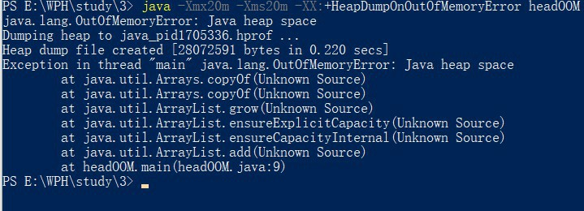
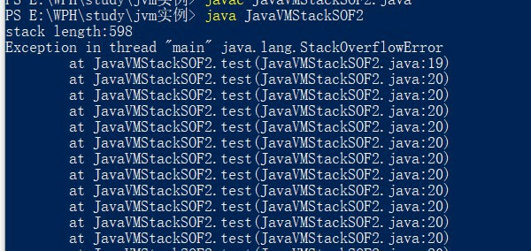
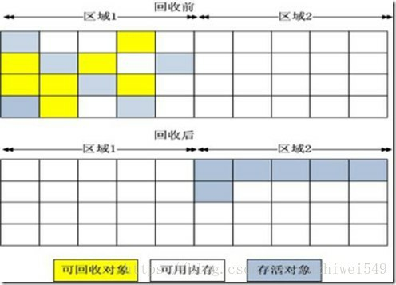
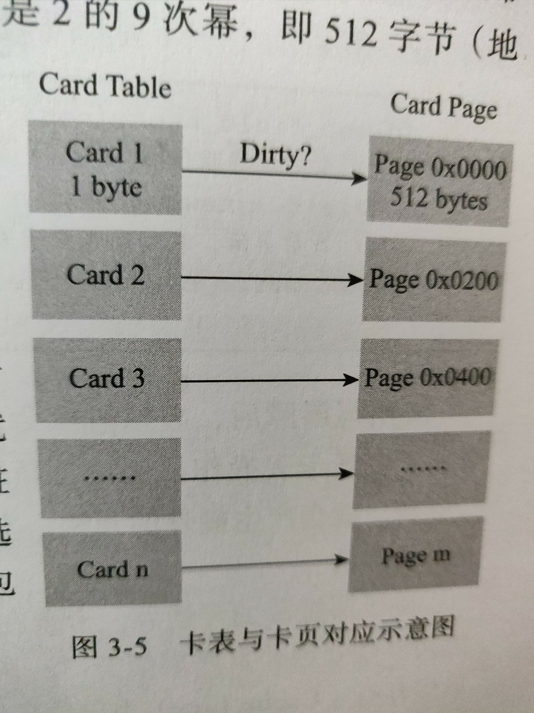
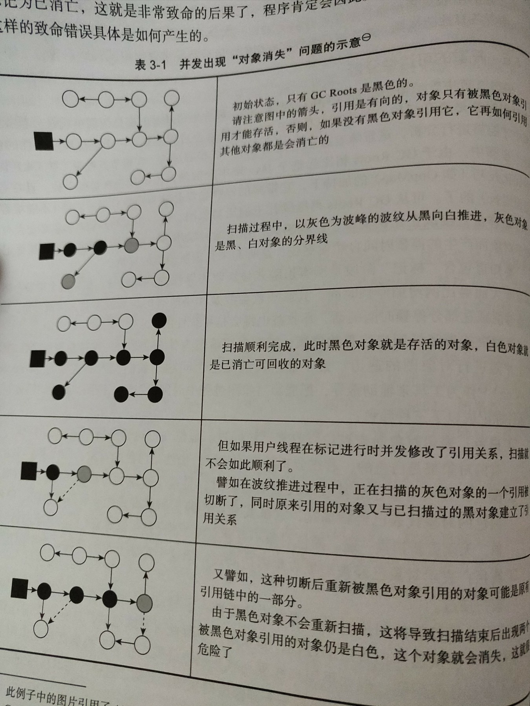

# 参考

第三版深入java虚拟机书籍

# 1. JAVA内存区域与内存溢出异常

## 1.1 运行时数据区域

两类区域

- 线程私有：随着jvm进程启动一直存在
- 线程共有：依赖线程启动和结束而建立和销毁


### 1.1.1 程序计数器 Program Counter Register

**功能**

字节码行号指示器。通过这个值选择下条需要执行的字节码指令。

>  程序控制流指示器、分支、循环、跳转、异常处理、线程恢复等基础功能依赖它完成

**类型**

线程私有

**注意点**

如果执行的是native方法，其值为空（Undefined）

唯一没有OOM情况的区域

### 1.1.2 Java虚拟机栈 Java Virtual Machine Stack

**功能**

生命周期与线程相同，描述java方法执行的线程内存模型

每个方法执行的时候

- jvm同步创建栈帧（Stack Frame）用于存储**局部变量表、操作数栈、动态连接、方法出口等信息**
- 方法调用过程对于一个栈帧入栈出栈过程

> 局部变量表：编译器可知的基本数据类型、对象引用(reference类型)、returnAddress类型(指向了一条字节码指令的地址)
>
> 其中存储空间以局部变量槽（slot）表示，槽大小是根据虚拟机决定的（一般32比特）
>
> 进入一个方法的时候，局部变量空间是确定的，方法运行期间是不会改变局部变量表的大小(只slot的数量)

**类型**

线程私有

**注意点**

栈深度溢出出现StackOverFlow

栈动态扩展时内存不足出现OOM

### 1.1.3 本地方法栈 Native Method Stacks 

**功能**

执行native本地方法的方法栈

> jvm规范没有强制规定，各个jvm有自己的实现
>
> hotspot 虚拟机栈 本地方法栈合二为一

**类型**

线程私有

**注意点**

栈深度溢出出现StackOverFlow

栈动态扩展时内存不足出现OOM

### 1.1.4 Java堆 Java Heap

**功能**

几乎所有实例和数组都在这里分配

> 规范规定必须所有，随着发展，一些栈上分配、标量替换优化手段不符合（特殊情况将实例直接分配到栈上）

垃圾收集管理器的管理的区域

> 详细后面会讲
>
> 注 hotspot出现了不采用分代设计的GC

也可以划分线程私有的分配缓冲区 TLAB （Tread Local Allocation Buffer）提升对象分配效率

**类型**

线程共享

**注意点**

逻辑上地址连续，物理上地址可以不连续，但出于高效，某些大对象，比如数组，还是要求物理连续存放

可以固定、也可扩展，大部分jvm实现时可扩展的

- -Xmx -Xms 设置堆大小

堆无法完成实例分配，且无法扩展时，OOM异常

### 1.1.5 方法区 Method Area

**功能**

存储已被虚拟机加载的类型信息、常量、静态变量、即时编译器编译后的代码缓存等数据。

> 方法区并不等于永久代，网络上经常会有这类错误的原因是因为。HOTSPOT很火，受众广，它的设计团队将GC的分代设计扩展至方法区，或者说用永久代实现方法区，省去为方法区编写内存管理代码的工作。对于其他JVM实现，是没有永久代这一概念的，比如IBM J9,JRockit等。
>
> 永久代容易导致OOM问题，因为可以自己设置大小。而J9和JRockit只要不超过进程可用内存上限，就不会有问题 （比如32位系统中4GB的限制）。永久代还会导致某些方法的不同表现，比如String::intern()，大的潜在隐患。
>
> JDK6，JDK7逐步放弃永久代，JDK8彻底抛弃，HOTSPOT团队和J9、JRockit中一样，在本地内存中实现元空间来代替。
>
> jvm规范对方法去约束非常宽松

**类型**

线程共享

**注意点**

内存不足，抛出OOM

### 1.1.6 运行时常量池 Runtime Constant Pool

**注意：它是方法区的一部分**

**注意：它是方法区的一部分**

**注意：它是方法区的一部分**

**功能**

Class文件中除了有类的版本、字段、方法、接口等描述信息，还有一项信息时常量池表（Constant Pool Table），用于**存放编译期生成的各种字面量与符号引用**，这部分内容将在**类加载后存放到方法区的运行时常量池**。

> jvm对于class文件格式要求很严格（当然包括常量池表），但是对运行时常量池没有细节要求

具备动态性

- 并非一定编译期产生，运行时也可以放入新的常量
- 典型例子 String::intern()

**类型**

线程共享

**注意点**

内存不足会发生OOM

### 1.2.7 直接内存 Direct Memory

**注意：并不是JVM运行时数据区的一部分，不是JVM规范中定义的内存区域**

**注意：并不是JVM运行时数据区的一部分，不是JVM规范中定义的内存区域**

**注意：并不是JVM运行时数据区的一部分，不是JVM规范中定义的内存区域**

但是它被频繁的使用，也可能出现OOM，所以放到一起讲

**功能**

JDK1.4引入的NIO类，引入了一种基于通道与缓冲区的I/O方式，可以使用Native函数库直接分配对外内存，然后通过一个存储在Java堆里面的DirectByteBuffer对象作为这块内存的引用进行操作。

> 显著提高性能，避免了Java堆在Native堆中来回复制数据

**类型**

特殊，非JVM内存区域规范相关

**注意点**

仍然受到本机总内存（物理内存、SWAP分区、分页文件）大小，处理器寻址空间的限制，导致OOM

> 若设置时只考虑了 -Xmx等实际内存，忽略直接内存，导致各个内存区域总和大于物理内存限制（物理和操作系统级的限制），动态扩展易于导致OOM

# 2. Hotspot虚拟机对象

## 2.1 对象创建

**第零步**

复制、反序列化、new关键字 触发了对象创建

**第一步**

在常量池定位类的符号引用，检查类有没有被加载、解析、初始化过

- 没有的话，需要执行一遍类加载过程（具体过程后面博客讲）

**第二步**

分配内存，要在堆中划分出一块确定大小的内存

> 对象的大小，类加载完之后可以确定，

两种分配方式：

- 内存中对象存放绝对规整，空闲的放一边，使用的放一边

  指针碰撞（Bump The Pointer），空闲和非空闲有个指针作为分界线，分配内存只要，指针挪动一段内存大小的距离

- 内存存放不规整

  则JVM要维护一个“空闲列表” （Free List），记录哪些块空闲，并且分配，更新列表记录

GC算法 决定 JVM内存是否规整 决定 分配方式

- Serial ParNew 带压缩整理功能的GC时，使用的就是指针碰撞的分配方式
- CMS 这类基于sweep算法的GC，只能用空闲列表的方式

分配的线程安全问题，两种解决方式

- 使用CAS对指针进行修改（指针碰撞的方式可用）

- TLAB 直接在各自划分好的TLAB里分配，满了才要同步锁定

  > -xx:+/-UseTLAB 指定是否使用TLAB 

**第三步**

到对应的内存区域初始化零值

> 使用了TLAB，会在TLAB完成

确保不赋初始值的情况下可以使用

**第四步**

必要的设置：设置对象头

- 设置对象是哪个类的实例、如何找到类的元数据信息、对象哈希码（实际上调用hashCode()才会计算）、对象GC分代年龄信息

**第五步**

上面工作完成后，从JVM角度看一个新的对象产生了

从程序角度看没有，创建才刚开始，执行构造函数

## 2.2 对象的内存布局

三个部分：**对象头（Header）、实例数据（Instance Data）、对齐填充（Padding）**

### 2.2.1 对象头

> [详细见此博客][https://kennyfortune.github.io/2020/04/13/%E5%A4%9A%E7%BA%BF%E7%A8%8B%E4%B8%8E%E9%AB%98%E5%B9%B6%E5%8F%91/]([https://kennyfortune.github.io/2020/04/13/%E5%A4%9A%E7%BA%BF%E7%A8%8B%E4%B8%8E%E9%AB%98%E5%B9%B6%E5%8F%91/](https://kennyfortune.github.io/2020/04/13/多线程与高并发/))

两类信息

1. Mark Word 存储对象自身运行时数据：哈希吗、GC分代年龄、锁状态标志、线程持有的锁、偏向线程ID、偏向时间戳

   长度在32位、64位系统分别位32位长和64位长（未开启指针压缩）

   | 存储内容                             | 标志位 | 状态               |
   | ------------------------------------ | ------ | ------------------ |
   | 对象哈希吗、对象分代年龄             | 01     | 未锁定             |
   | 指向锁记录的执政                     | 00     | 轻量级锁定         |
   | 指向重量级锁的指针                   | 10     | 膨胀（重量级锁定） |
   | 空、不需要记录信息                   | 11     | GC标记             |
   | 偏向线程ID、偏向时间戳、对象分代年龄 | 01     | 可偏向             |

2. 类型指针、指向类型元数据的执政，判断是哪个类的实例。

   开启指针压缩 32比特 4字节 关闭指针压缩 64比特 8字节

   > 查找对象元数据不一定会经过对象本身，下面2.3会讲

### 2.2.2 实例数据

存储顺序 收到虚拟机分配策略参数 -XX:FieldsAllocationStyle参数影响

> 默认分配顺序：long/double、int、short、char、byte/boolean、oops（Ordinary Object Pointers 普通对象指针）

如果 +XX:CompactFields，允许子类中较窄的变量插入父类变量空隙之中，以节省出一点点空间。

### 2.2.3 对齐填充

腰围8字节的整倍数，不足填充

## 2.3 对象的访问定位

程序通过栈中**reference类型**，来操作堆上对象，规范没有规定具体定位实现

**主流访问方式两种**：句柄访问和直接指针

> 就**HotSpot**而言，他使用的是**直接指针访问方式**进行对象访问，但从整个软件开发的范围来看，各种语言和框架使用句柄来访问的情况也十分常见。

### 2.3.1 句柄访问

java堆中会划分出一块内存作为句柄池、reference存储的是句柄地址

**优点**

对象移动位置时（GC尤为常见），只需要更改句柄指针的值，而不用更改reference的值


### 2.3.2 直接访问

reference直接存储对象地址

**优点**

直接访问对象快，不用像句柄进行二次定位的开销


## 2.4 OOM实战代码（主要体会JVM参数）

### 2.4.1 堆OOM

```java
import java.lang.*;
import java.util.*;
public class headOOM{
    static class OOMObject{
    }
    public static void main(String[] args){
        List<OOMObject> list = new ArrayList<OOMObject>();
        while(true){
            list.add(new OOMObject());
        }
    }
}
```

使用的参数

-Xms 设置堆最小值

-Xmx 堆最大值

> 设置成一样可以避免堆扩展

-XX:+HeapDumpOnOutOfMemoryError 出现OOM的时候Dump出当前内存堆转储快照以便进行时候分析

`java -Xmx20m -Xms20m -XX:+HeapDumpOnOutOfMemoryError headOOM`



检错思路

判断时**内存泄漏 memory leak 还是内存溢出 memory overflow**

使用内存映像分析工具分析   .hprof文件

如果是需要回收的内存 内存泄漏，观看GC Roots引用链，找出不能回收的原因

如果时不需要回收的内存 内存溢出，调整jvm内存参数，看看硬件可用内存情况，找找有没有设计不合理的地方

- 比如某些对象声明周期过长、持有状态事件过长

### 2.4.2 虚拟机栈、本地方法栈SOF和OOM

**SOF**

```java
//第一种限制虚拟机栈大小
import java.util.*;
import java.lang.*;
public class JavaVMStackSOF{
	private int stackLength = 1;
	public void stackLeak(){
		stackLength++;
		stackLeak();
	}
	public static void main(String[] args){
		JavaVMStackSOF oom = new JavaVMStackSOF();
		try{
			oom.stackLeak();
		}
		catch{
			System.out.println("stack length:" + oom.stackLength);
			throw e;
		}
	}
}
```

使用的jvm参数

-Xss 设置虚拟机栈内存容量

-Xoss 设置本地方法栈内存容量

> hotspot没有本地方法栈，功能由虚拟机栈一并实现了，所以Xoss参数对它无效

`java -Xss128k JavaVMStackSOF`


```java
//栈帧非常大
import java.util.*;
import java.lang.*;
public class JavaVMStackSOF2{
	private static int stackLength = 0;
	public static void test(){
		long
		u1,u2,u3,u4,u5,u6,u7,u8,u9
		,u10,u11,u12,u13,u14,u15,u16,u17,u18
		,u19,u20,u21,u22,u23,u24,u25,u26,u27
		,u28,u29,u30,u31,u32,u33,u34,u35,u36
		,u37,u38,u39,u40,u41,u42,u43,u44,u45
		,u46,u47,u48,u49,u50,u51,u52,u53,u54
		,u55,u56,u57,u58,u59,u60,u61,u62,u63
		,u64,u65,u66,u67,u68,u69,u70,u71,u72
		,u73,u74,u75,u76,u77,u78,u79,u80,u81
		,u82,u83,u84,u85,u86,u87,u88,u89,u90
		,u91,u92,u93,u94,u95,u96,u97,u98,u99
		,u100;
		stackLength++;
		test();
		u1=u2=u3=u4=u5=u6=u7=u8=u9
		=u10=u11=u12=u13=u14=u15=u16=u17=u18
		=u19=u20=u21=u22=u23=u24=u25=u26=u27
		=u28=u29=u30=u31=u32=u33=u34=u35=u36
		=u37=u38=u39=u40=u41=u42=u43=u44=u45
		=u46=u47=u48=u49=u50=u51=u52=u53=u54
		=u55=u56=u57=u58=u59=u60=u61=u62=u63
		=u64=u65=u66=u67=u68=u69=u70=u71=u72
		=u73=u74=u75=u76=u77=u78=u79=u80=u81
		=u82=u83=u84=u85=u86=u87=u88=u89=u90
		=u91=u92=u93=u94=u95=u96=u97=u98=u99
		=u100=0;
		
	}
	public static void main(String[] args){
		try{
			test();
		}
		catch(Throwable e){
			System.out.println("stack length:" + stackLength);
			throw e;
		}
	}
}
```

`java JavaVMStackSOF2`

 

**两种都抛出SOF**

> 对于第二种栈帧过大，但没设置虚拟机栈大小的情况，使用动态扩展的jvm实现会产生OOM（比如老旧的Classic）,hotspot为啥报SOF如下文

**OOM**

**对于上述两种普通情况hotspot压根实现不了，原因如下**

> jvm规范中规定，无法申请足够的栈深度为SOF，栈动态扩展中才会出现OOM
>
> hotspot实现不允许虚拟机栈动态扩展，所以不存在扩展中导致的OOM
>
> 所以hotspot只有sof

**但是还有特殊情况hotspot在虚拟机栈可以产生OOM**

**建立过多线程**

> OS分配个进程的内存时有限的，比如32为位系统最多分配2GB给一个进程，这个内存减去堆、方法区、PC所占的内存，便是各个线程所剩下的虚拟机栈、本地方法栈空间

由此可见、线程越多，栈空间分配下来就越少，线程多到一定数量的时候，**导致无法创建线程的OOM**

代码如下，32位系统下允许，注意可能导致操作系统假死，危险系数很高，不要轻易执行，仅提供代码

```java
public lcass JavaVMStackOOM{
    private dontStop(){
        while(true){
            
        }
    }
    public void stackLeakByThread(){
        while(true){
            Thread thread = new Thread(new Runnable(){
                @Override
                public void run(){
                    dontStop();
                }
            })};
        	thread.start();
        }
    }
    public static void main(String[] args) throws Throwable{
        List<OOMObject> list = new ArrayList<OOMObject>();
        while(true){
            list.add(new OOMObject());
        }
    }
}
```

解决方案：更换64位系统，减少线程数量

极端解决方案：减少堆空间或者栈容量换取更多的线程数量

### 2.4.3 方法区和运行时常量池OOM

核心方法 string.intern()

> 如果在常量池找到与这个字符串相等的字符串，则会返回常量池中这个相等的引用，否则会将调用intern()的字符串加入常量池，返回其自身引用
>
> 想了解更多见
>
> https://blog.csdn.net/tyyking/article/details/82496901

jdk6中，它会将首次遇到的刺符传复制到永久代字符串常量池中存储，导致可能永久代内存不足OOM

jdk7之后，字符串常量池移到java堆中，只需要在常量池记录一下首次出现的实例就可以了

cglib等动态生成新类型测字节码技术（实际上在主流框架中很常见）可能导致GC无法及时收集（其生成之后的依赖关系可能很复杂），大量的新类型需要占用了方法区，导致OOM

到jdk8之后，永久代彻底消失，上述生成大量动态类的应用场景里，也很难出现OOM了，完全交由元空间来管理

三个涉及元空间的参数

-XX:MetaspaceSize

- 元空间最大值，默认-1，即无限制（或者说受本地内存大小限制）

-XX:MetaspaceSize

- 指定初始空间大小、字节为单位、达到该值会出发类型卸载、同时收集器会对该值机型调整（如果释放大量空间就降低该值、如果释放很少空间就提升该值（不会超过上个参数设定的最大值））

-XX:MinMetaspaceFreeRatio

- 控制GC之后最小的元空间剩余容量的百分比，减少因为元空间不足导致的GC的频率

-XX:MaxMetaspaceFreeRatio

### 2.4.4 本机直接内存溢出

-XX:MaxDirectMemorySize 设定直接那日村

- 默认与 Xmx一致

使用DirectByteBuffer分配，空间不足的时候也会OOM，但是那个它计算出来的，并没有真正申请分配内存

如果想要真正分配内存需要使用通过范式使用Unsafe实例分配

Unsafe::allocateMemory()

出现直接内存溢出的指证

- Head Dump文件看不出明显异常
- 产生的Dump文件很小，程序又使用了NIO，可以考虑检查这个问题

# 3. 垃圾收集器与内存分配策略

> 即使GC已经进入自动化时代，我们仍需要了解的原因是GC成为了高并发量的瓶颈时，我们必须堆这些自动化的技术实施必要的监控和调节

## 3.1 对象已死？

### 3.1.1 引用计数算法 Reference Counting

在对象添加一个引用计数器，一个地方引用它就+1，引用失效它就-1

**优点**

- 高效
- 原理简单、判定效率很高
- 只占用了一片小的额外内存

> 比如 python、一些游戏脚本领域使用
>
> java没有使用 

**缺点**

A B成员变量互相持有对方引用 无法被GC

### 3.1.2 可达性分析算法 Reachability analysis

通过一系列称为“GC Roots”的根对象作为起始节点集，从这节点根据引用关系向下搜索，走过的路径称为“引用链” Reference Chain 来判断可达性

**java中固定可做GC Root的对象包括**

- 虚拟机栈（栈帧中的本地变量表）中引用的对象，各个线程被调用的方法堆栈中使用到的参数、局部变量、临时变量
- 方法区中类静态属性引用的对象，如Java类的引用类型静态变量
- 方法区中常量引用的对象，如字符串常量池String Table的引用
- 本地方法栈中JNI （Native方法）引用的对象
- Java虚拟机内部的引用，如基本数据类型对应的Class对象，一些常驻的异常对象（NullPointException、OutOfMMemoryError）等，还有系统类加载器
- 所有被同步锁（sychronized）持有的对象
- 反映Java虚拟机内部情况JMXBean，JVMTI中注册的回调、本地代码缓存等

**GC“临时性”加入的对象**

> 与选用的垃圾收集器以及当前回收的内存区域有关而不同

- 局部回收 Partial GC

  > 只针对一部分，典型的是新生代的垃圾收集，必须考虑其他区域的对象的引用，需要将关联区域的对象一并考虑加入到GC Roots集合中区，保证可达性分析的正确性

### 3.1.3 引用类型

>  JDK1.2之前，reference类型就是简单的内存起始地址，这导致了类型只有被引用和不被引用的状态，过于简单了

**强引用**

传统引用的概念

**软引用**

SoftReference

GC时，内存不足，不回收

**弱引用**

WeakReference

GC回收的时候，无论内存足部足够，会回收到弱引用关联的对象

**虚引用**

Phantom Reference

对对象到的生存时间没有影响，无法通过虚引用来取得一个对象实例。

在对象的被GC回收的时候会受到一个系统通知

具体作用见博客

[https://kennyfortune.github.io/2020/04/13/%E5%BC%BA%E8%BD%AF%E5%BC%B1%E8%99%9A/](https://kennyfortune.github.io/2020/04/13/强软弱虚/)

### 3.1.4 Finalize

> Finialize() 不要使用这种语法

判定为不可达状态后，要宣告一个对象死亡，至少经历两次标记过程

**第一步**

第一次可达性分析后，不再引用链的将会被第一次标记

**第二步**

判断对象是否有必要执行finalize()方法

- 对象重写了finalize，则需要执行

- 对象没有重写或者finalize已经被虚拟机调用过，就是没有必要执行

  > 任何一个对象的finalize()只会被系统调用一次，第二次之后就不会再执行了

**第三步 如果有必要执行finalize才会这么做**

把对象放置在一个名为F-Queue的队列中

稍后由一条虚拟机自动建立的，低调度优先级的Finalizer线程区执行它们的finalize()方法。

> 这个执行指触发运行，不保证等待它允许结束
>
> 这种涉及是为了防止里面执行缓慢、甚至死循环导致整个内存回收子系统崩溃

之后会对F-Queue的对象进行第二次小规模的标记

> 这是最后一次逃脱死亡命运的机会
>
> 只要在finalize()中成功与引用链上的任何一个对象建立关联即可

如果真的没逃脱，那么就要被回收了

```java
import java.util.*;
import java.lang.*;
public class FinalizeEscapeGC{
	public static FinalizeEscapeGC SAVE_HOOK = null;
	public void isAlive(){
		System.out.println("alive");
	}
	@Override
	protected void finalize() throws Throwable{
		super.finalize();
		System.out.println("finalize execute");
		FinalizeEscapeGC.SAVE_HOOK = this;
	}
	
	public static void main(String[] args) throws Throwable{ 
	
		SAVE_HOOK = new FinalizeEscapeGC();
	
		SAVE_HOOK = null;
		System.gc();
		Thread.sleep(1500);
		if(SAVE_HOOK!=null){
			SAVE_HOOK.isAlive();
		}
		else{
			System.out.println("i am dead");
		}
		
		SAVE_HOOK = null;
		System.gc();
		Thread.sleep(1500);
		if(SAVE_HOOK!=null){
			SAVE_HOOK.isAlive();
		}
		else{
			System.out.println("i am dead");
		}
	}
}
```

### 3.1.5 回收方法区

规范没有要求

- 性价比低

主要回收废弃的常量和不再使用的类型

**常量**（还算容易回收）

- 判断没有引用就行

  > 如 “java” 字符串常量，没有引用就会回收

**类型**（非常难以回收，条件苛刻）

- 所有实例都被回收，包括派生类

- 加载类的加载器已经被回收

  > 这个条件只存在于精心设计过的可替换类加载器的场景，比如OSGi，JSP的重加载
  >
  > 这个条件很苛刻

- 该类的java.lang.Class对象没有被任何地方引用，无法再任何地方通过反射获得该类的方法

满足这三个条件仅仅是“被允许”回收

无类型卸载

-Xnoclassgc

查看类加载和卸载信息

-verbose:class

-XX:+TraceClassLoading

-XX:+TraceClassUnLoading

> 在大量使用反射、动态代理、CGLib等字节码框架，动态生成JSP以及OSGi这类频繁自定义类加载器的场景中，通过需要JVM具备类型卸载的能力，以保证不会对方法区造成过大的压力

## 3.2 垃圾收集算法

两类

**引用技术式垃圾收集 Reference Counting GC**

**追踪式垃圾收集 Tracing GC** 两大类

### 3.2.1 分代收集理论

**弱分代假说 Weak Generational Hypothesis**

- 绝大多数对象都是朝生夕灭的

**强分代假说 Strong Generational Hypothesis**

- 熬过越多次GC过程的对象就越难以消亡

**跨代引用假说 Intergenerational Reference Hypothesis** 

- 存在互相引用关系的对象，倾向于同时生成同时消亡

奠定一个一致设计原则：收集器应该将JAVA堆划分出不同的区域，然后将回收对象依据其年龄分配到不同的区域中存储

部分收集 Partial GC

- 新生代收集 Minor GC/Young GC

- 年老代收集 Major GC/Old GC

  > 目前只有CMS收集器由单独收集老年代的行为
  >
  > major gc说法现在优点混淆，可能有的地方是整堆收集，要联系上下文

### 3.2.2 GC算法

**标记-清除算法**

- 通过标记清除

  > 可以标记可达的也可以标记不可达的

- 导致碎片化严重


**标记-复制算法**

半区复制 Semispace Copying



基于这算法提出了 Appel式回收 的复制分代策略

- 分为 Eden Survivor 两个区域 大概8：1 还有10%的空间是浪费的，故意限制

新建对象放入Eden，内存不足触发minor gc

采用标记-复制算法，将 eden 和 survivor的存活对象，复制到那10%的区域，然后将这区域作为survivor

- 另一种常见的说法是 eden ： survivor from ：survivor to 一个意思

若这个区域放不下，进行**分配担保**（**handle promotion**），就放入年老代

**标记-整理算法**


常用于年老代

移动是极为附中的操作，因为要停止对象的更新，所以要暂停用户应用程序才能进行，这种停顿，被称为 **Stop The World**

如果整理，使用这种方法，提高了吞吐量、却导致时延增加（要stop the world）；

> 关注吞吐量的 Parallel Scavenge是采用这种

如果不整理，就会导致需要在硬盘上存储访问数据，这个过程吞吐量实际是降低的

> 关注时延的 CMS收集器 则是基于标记-清除算法的
>
> 直到碎片过多，影响对象分配的时候 CMS才辉使用标记整理

## 3.3 HotSpot算法实现细节

### 3.3.1 根节点枚举 Root Set Enumeration

**需要解决的问题：**

- 遍历所有类、常量完全不现实，时间花费承受不起

- 需要在一个能保障一致性的快照中才能进行，类似前面移动对象所遇到的“stop the world”的问题，需要停顿

  > 即使是号称停顿时间可控，或几乎不会发生停顿的CMS、G1、ZGC等收集器，枚举根节点时也是必须要停顿的

需要**提供寻找引用和停顿的机制**

**HotSpot机制**

OopMap的数据结构

> 普通对象指针map

类加载完成时候，会把对象内偏移量上时什么类型的数据计算出来，在即时编译过程中，会在特定的位置记录下栈里和寄存器里时哪些位置是引用。

搜集器直接扫面这个数据结构就行，**解决了第一个问题**

### 3.3.2 安全点 Safepoint

太多的指令会导致OopMap内容的变化，如果每条指令都生成对应的OopMap，空间成本会无法忍受。

HotSpot 也确实没有为每条指令生成OopMap，它使用了Safepoint机制

**安全点**

- 强制用户程序必须执行到安全点才能暂停

- 太少->GC等待太长 太多->暂停太频繁，增加内存负荷

- 位置的选取以“是否具有让程序长时间执行的特征”为标准。

  > 因为每条指令执行的时间都非常短暂，程序不太可能因为这样的原因而长时间执行

- 长时间执行的最明显特征是指令序列的复用，例如方法调用、循环跳转、异常跳转等，所以只有这些功能的指令才会产生安全点

**如何让线程都跑到最近的安全点**

（这不包括执行JNI调用的线程）

抢占式中断 Preemptive Suspension

- 不需要线程主动配合

- 中断所有线程

- 找到所有没到安全点的线程，让他恢复执行，过会中，直到跑到安全点

  > 市面上几乎没有虚拟机实现采用抢占式中断来暂停线程了

主动式中断Voluntary Suspension

- 设置一个标志位，各个线程执行的时候不停主动轮询
- 一旦发现中断标志为真，就在最近的安全点上主动中断挂起
- 轮询标志的地方
  - 和安全点重合，检测为真直接中断挂起就是安全点
  - 创建对象和需要在堆上分配内存的地方，这是为了检查是否即将发生GC，避免没有足够内存分配新对象

**确保轮询的高效性**

>  频繁出现，要求足够高效

hotspot 使用内存保护陷阱的方式，一条汇编高效完成

`test %eax,0x160100`

jvm把,0x160100设置为不可读，那执行test的时候就会产生一个自陷异常信号，在预先注册的异常处理器挂起线程实现等待。

这样就**解决了第二个问题**

### 3.3.3 安全区域 Safe Region

安全点解决第二个问题的漏洞：不执行的程序怎么办，蔽日sleep，blocked的线程，无法响应中断请求，无法运行到安全点，JVM也不能等待其重新激活。

引入了 **安全区域**

- 确保某一段代码片段中，引用关系不会变化，因此在这个片段任意地方开始GC都是安全的

  > 可以看出被扩展拉伸的安全点

- 线程执行到安全区域里面的代码时，首先会标识自己已经进入了安全区域，那这段时间GC就不必管这个线程
- 线程离开安全区域的时候要检查JVM是否完成了根节点枚举（或者GC其他要暂停的阶段）完成了，正常离开，没有完成的话，线程必须等待。

> 换句话说 线程blocked sleep之后，一定是进入安全区域的，对于它们不需要到安全点GC，可以直接进行根节点枚举和其他操作
>
> 同理JNI调用也是一个道理，本地方法不应该影响JVM，所以JNI也是安全区域

### 3.3.4 记忆集与卡表

为解决跨代引用产生的解决方案

> 不只是新生代老年代有跨代引用问题
>
> 只要有Partical GC就要考虑

**记忆集 Remembered Set**

用于记录从非收集区域指向收集区域的指针集合的抽象数据结构

```java
//一种不考虑效率、成本的实现伪码
class RenenveredSet
{
    Object[] set[SIZE];
}
```

> 收集器应该只需要通过记忆集判断出某一块非收集区域是否存在指向了收集区域的指针就可以了，不需要理解跨代指针的全部细节。

下面是可供选择的记录精度

- 字长精度：每个记录精确到一个机器字长（就是处理器的寻址位数，这个精度决定了机器访问物理内存地址的指针长度），该字包含跨代指针
- 对象精度：每个记录精确到一个对象、该对象里有字段含有跨代指针
- 卡精度：每个记录精确到一块内存区域，该区域内对象含有跨代指针

**卡精度详解**

使用 卡表 card table 

> 最常用的记忆集的实现

卡表最简单的形式可以是一个字节数组

> 这是hotspot的实现

`CARD_TABLE [this address>>9] = 0;`

> 字节数组是效率上的考量，bit数组现需要额外的shift+mask指令

每个元素对应着其标识的内存区域中一块特定大小的内存块、称为“卡页” Card Page 

这一块内存可能包含多个对象

标识为1代表脏元素，0代表不脏

取脏元素的位置，扫描对应内存的所有对象，加入GC roots



**卡精度写屏障机制** write barrier

如何在对象赋值的那一刻更新维护卡表？

- 解释执行，方便，有充分的时间
- 编译执行：需要找到机器码层面的手段，把维护卡表的动作放到每一个赋值操作中

**hotspot的实现：写屏障**

> 与并发乱序执行的 内存屏障 不是一回事，要注意
>
> 类似在jvm层面对引用类型字段赋值的AOP切面

赋值前：写前屏障 Pre-Write Barrier

赋值后：写后屏障 Post-Write Barrier

> 许多收集器使用了写后屏障
>
> G1两个都使用了

```c
//简化逻辑
void oop_field_store(oop* field, oop new_value){
    *field = new_value;
    post_write_barrier(field,new_value);
}
```

卡表高并发下的”伪共享“问题

> cpu cache导致的 详细看博客java多线程和高并发文章

卡表字节数组在一个cache line的时候，多个线程各自修改数据导致伪共享，效率变低

- 开启判断，增加每次判断的开销，但避免伪共享，各有损耗

```c
//一种解决
//不采用无条件的写屏障，而是判断该卡表元素未被标记过时，才将其标记为变脏、

if (CARD_TABLE[this address >> 9]!=0){
    //一个标记 卡页512byte 所以右移9位
    //对于同一个卡页 内的各个地址 >>9 之后是同个标识位 会有重写，换句话说，这个确认其被标识过才会置卡表
    CARD_TABLE[this address >> 9] = 0;
}
```

-XX:+UseCondCardMark

- 决定是否开启卡表更新

### 3.3.5 并发的可达性分析

**想要解决或降低用户停顿，先要理解追踪式GC算法的共同特征”标记“**

引入三色标记Tri-color Marking作为工具辅助推到

- 白色：对象违背垃圾收集器访问过
- 黑色：对象已经被垃圾收集器访问过，且这个对象所有引用都被扫描过。如果有对象指向黑色对象，无需重复访问。黑色不可能直接指向白色
- 灰色：对象已经被垃圾收集器访问过，且这个对象有引用没扫描过



**对象的错误GC，当且仅当以下两个条件同时满足**

- 复制器插入了一条或多条从黑色对象到白色对象的新引用
- 复制器删除了全部从灰色对象到该白色对象的直接或间接引用

破坏其中之一就可以

- 增量更新 Incremental Update
- 原始快照 Snapshot At The Beginning, STAB

**增量更新**

新增引用关系的时候记录下来，并发扫描结束，再根据这些引用关系的黑色节点，再扫描一次

> 相当于指向的白色节点变成灰色节点，等到一次结束之后再处理
>
> CMS的实现

**原始快照**

当灰色节点删除指向白色的引用关系时，将这个删除的引用记录下来。结束时，再将记录过的引用关系中的灰色对象为根，再扫描一边。

> 相当于，用开始扫描那一刻的对象图快照来进行搜索
>
> G1、Shenandoah的实现

两种都需要进行一次额外的标记

## 3.4 经典垃圾收集器


> JDK9 取消了如图的组合使用方式

**Serial 收集器**

复制算法

新生代的收集器

单线程

收集时，暂停所有线程，stop the world

简单高效

适用于客户端、微服务等内存比较小的、并发要求低的场景

**ParNew 收集器**

Serial的多线程版本，其他一样

目前只有它能和CMS配合工作

常用于服务端

线程默认数量和CPU核一样多

- -XX:ParallelGCThreads 控制数量

**Parallel Scavenge 收集器**

复制算法

新生代的收集器

关注程序达到一个可控制的吞吐量

- Thoughput， CPU 用于运行用户代码
  的时间/CPU 总消耗时间，即吞吐量=运行用户代码时间/(运行用户代码时间+垃圾收集时间)） 

自适应调节策略 也是区别于ParNew收集器的一个重要区别

**Serial Old 收集器**

单线程

标记整理

serial的年老代版本

默认运行在客户端

**Parallel Old 收集器**

多线程

标记整理

Parallel Scavenge年老代版本

吞吐量优先

**CMS 收集器 concurrent mark sweep**

标记清除

以获取最短回收停顿时间为目标的

> 基于浏览器的B/S系统的服务端上

**步骤**

- 初始标记 CMS initial mark
  - 根节点集枚举，stop the world
- 并发标记 CMS concurrent mark
  - 和用户线程一起工作

- 重新标记 CMS remark
  - 修正并发期间的标记，仍要stop the world
- 并发清除 CMS concurrent sweep
  - 可以与用户线程并发

**标记阶段不需要停顿，但是需要二次标记**

- 前面增量更新内容提到了

**缺点**

- 对处理器资源非常敏感，占用CPU资源

  > 回收线程数，为（CPU核数+3）/4
  >
  > 核数量不足4的时候影响巨大

- 无法处理浮动垃圾（并发清除时产生的垃圾），所以必须预留一部分空间给并发清除阶段的用户线程使用
- 碎片化严重的时候需要FULL GC

**Garbage First 收集器**

面向服务端

既有新生代也有年老代

标记-整理算法，不产生内存碎片

可以非常精确控制停顿时间，再不牺牲吞吐量前提下，实现地停顿垃圾回收

**这么NB的功能，是怎么实现的呢**

**Region**

G1跳出新生代年老代的樊笼，可以面向堆内存任何部分来组成回收集（Collection Set，CSet）进行回收，衡量标准不再是它术语哪个分代

这个就是G1收集器的**Mixed GC**模式

基于Region的堆内存布局

- 划分为多个大小相等的独立区域Region

- 每一个Region都可以根据需要，扮演新生代的Eden空间、Survivor空间或者老年代空间

  > 这样无论新旧对象都能很好二度收集

还有一种特殊的Humongous区域，专门存储大对象。

- -XX:G1HeapRegionSize 设定Region大小

对于超出整个Region容量的超级大对象，将会被存放在N个连续的Humongous Region之中，G1的大多数行为都把Humongous Region作为i老年代的一部分来进行看待

**更具体地处理**

让G1跟踪各个Region里面地垃圾堆积的”价值“大小，价值即回收所获得的空间大小以及回收所需时间的经验值，然后再后台维护一个优先级列表，每次根据用户设定运行的收集停顿时间（-XX:MaxGCPauseMillis执行，默认200ms）优先处理回收价值收益最大的哪些Region，这就是Garbage First的由来。按优先级回收。

**困难**

- 跨代引用问题，G1的记忆集存储，本只是个哈希表。key是Region起始地址，Value是一个集合，里面存储的元素是卡表的索引号。这种”双向“的卡表结构，比原来的卡表实现起来更复杂，更高的内存负担。（占10%-20%的堆内存）

- 收集线程与用户线程互不干扰地运行。采用原始快照地算法，它为每一个Region涉及了两个名为TAMS（Top at Mark Start）的指针，把Region的有一部分空间划分出来用于并发回收过程中新对象的分配，并发回收时新分配的对象地址都必须要在这两个指针位置以上。G1收集器默认在这个地址以上的对象是被隐式标记过的，即默认它们是存货的，不纳入回收范围。

  如果内存回收的速度赶不上内存分配的速度，G1也要被迫冻结用户线程执行，导致Full GC而产生长时间，”Stop The World“

- 建立可靠的停顿预测模型。衰减均值（Decaying Average）为理论基础来实现的，GC时，G1收集器会记录每个Region的回收耗时、每个Region记忆集里的脏卡数量等各个可测量的步骤花费的成本，分析得出平均值、标准偏差、置信度等统计信息。这个统计状态决定回收的价值，在不超过期望停顿时间的约束下获得最高的收益。

**四个步骤**

- 初始标记 Initial Marking

  标记GCROOT能直接关联的对象，修改TAMS指针的值，在下一阶段用户线程并发运行时，能正确地在可用的Region中分配新对象。stop the world，借用进行Minor GC的时候同步完成的，所以G1收集器在这个阶段实际并没有额外的停顿

- 并发标记 Concurrent Marking

  可达性分析，扫描堆里的对象图，找出要回收的对象，这阶段耗时较长，但可与用户程序并发执行。

- 最终标记 Final Marking

  原始快照的二次标记

- 筛选回收

  更新Region的统计数据，对Region根据回收价值核成本进行排序，根据期望的停顿时间，制定回收计划

**缺点**

> 并不一定比CMS好，小应哟个内存CMS比较好

- 内存占用 Footprint 运行的额外执行负载 Overload 都要比CMS要高
- G1的写屏障不得不将其时限为类似于消息队列的机构，写前屏障、写后屏障的事情都放到队列里，在异步处理

## 3.5 低延迟垃圾收集器

三元悖论：footprint、throughout、latency

> latency称为最关注的点，另外两点随着硬件发展逐渐不再是瓶颈，而latency随着内存增加导致延迟更大了

两款实验性的，极低延迟的GC收集器

**Shenandoah收集器**

待补充

**ZGC**

待补充

## 3.6 选择合适的垃圾收集器

待补充

## 3.7 GC实战

待补充

