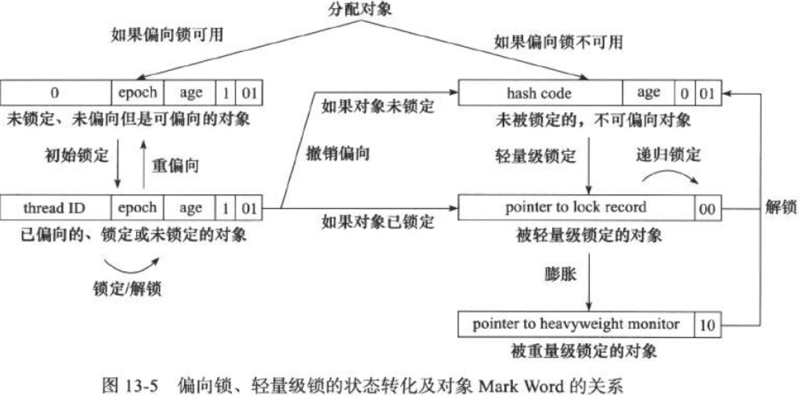
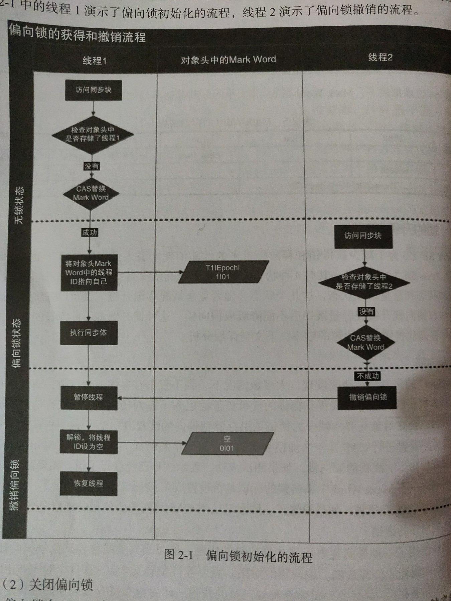
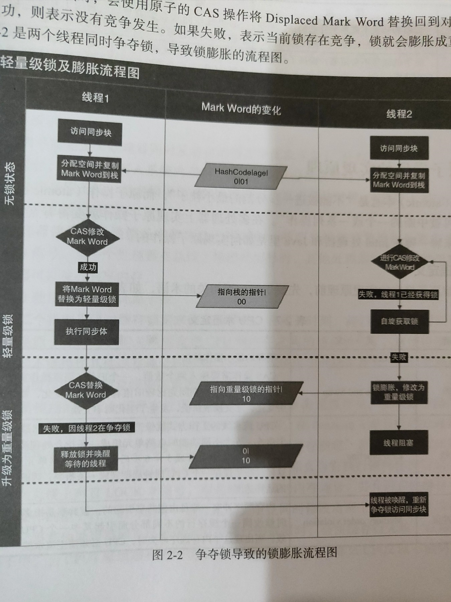
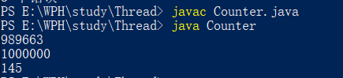

# 参考

java并发编程的艺术艺术

# 1.理解并发的挑战

## 1.1 上下文的切换

机制：时间片分配算法——一个时间片一般几十ms

**问题1：并发一定比线程快？**

对比执行

```java
public class ConcurrencyTest{
    private static final long count = 100001;
	
	public static void main(String[] args) throws InterruptedException{
	    concurrency();
		serial();
	}

    private static void concurrency() throws InterruptedException{
	    long start = System.currentTimeMillis();
		
		Thread thread = new Thread(new Runnable(){
			@Override
			public void run(){
			    int a = 0;
				for(long i = 0;i<count;i++){
					a += 5;
				}
			}
		});
		thread.start();
		int b = 0;
		for (long i = 0;i < count;i++){
		    b--;	
		}
		thread.join();
		long time = System.currentTimeMillis() - start;
		System.out.println("concurrency :" + time + "ms,b=" + b);
	
	}
	private static void serial(){
		long start = System.currentTimeMillis();
		int a = 0;
		for(long i = 0;i < count;i++){
		    a+=5;
		}
		int b = 0;
		for(long i = 0;i < count;i++){
			b--;
		}
		long time = System.currentTimeMillis() - start;
		System.out.println("serial :" + time + "ms,b=" + b + ",a="+a);
	}
}
```

执行结果：


```powershell
concurrency :4ms,b=-100001
serial :3ms,b=-100001,a=500005
```

慢的愿意就是线程的创建和上下文的切换带来的开销

> 使用性能分析工具度量上下文切换带来的消耗
>
> Lmbench3  vmstat等

**问题2：如何减少上下文切换？**

无锁并发编程。如将Hash算法取模分段，不同的线程处理不同段的数据

- 如java内的CocurrencyHashMap

CAS算法。

- 如Java里的Atomic类

使用最少线程

- 设计上避免不需要的线程

协程

- 单线程里实现多任务的调度，并在单线程里维持多个任务间的切换

## 1.2 死锁

一个死锁的实例

```java
public class DeadLockDemo{
	private static String A = "A";
	private static String B = "B";
	
	public static void main(String[] args){
		new DeadLockDemo().deadLock();
	}
	
	
	private void deadLock(){
		Thread t1 = new Thread(new Runnable(){
			@Override
			public void run(){
				synchronized(A){
					System.out.println("t1.start");
					try{
						Thread.currentThread().sleep(2000);
					}catch(InterruptedException e){
						e.printStackTrace();
					}
					synchronized(B){
						System.out.println("1");
					}
				}
			}
		});
		Thread t2 = new Thread(new Runnable(){
			@Override
			public void run(){
				synchronized(B){
					System.out.println("t2.start");
					synchronized(A){
						System.out.println("2");
					}
				}
			}
		});
		t1.start();
		t2.start();
	}
}
```

执行结果 阻塞

```powershell
PS E:\WPH\study\Thread> java DeadLockDemo
t1.start
t2.start
```

# 2.Java并发机制的底层实现原理

> 也可以参考 [https://kennyfortune.github.io/2020/04/13/%E5%A4%9A%E7%BA%BF%E7%A8%8B%E4%B8%8E%E9%AB%98%E5%B9%B6%E5%8F%91/](https://kennyfortune.github.io/2020/04/13/多线程与高并发/)

## 2.1 volatile的应用

**名词定义**

| 术语          | 英文单词               | 术语描述                                                     |
| ------------- | ---------------------- | ------------------------------------------------------------ |
| 内存屏障      | memory barriers        | 是一组处理器指令，用于实现对内存操作的顺序限制               |
| 缓存行/缓存行 | cache line             | CPU高速缓存中可以分配的最小存储单位。处理器填写缓存行时会加载整个缓存行，现代CPU需要执行几百次CPU指令。 |
| 原子操作      | atomic operations      | 不可中断的一个或一系列操作                                   |
| 缓存行填充    | cache line fill        | 当处理器识别到从内存中读取操作数是可缓存的，处理器读取整个高速缓存行到适当的缓存（L1，L2，L3的或所有） |
| 缓存命中      | cache hit              | 如果进行高速缓存行填充操作的内存位置仍然是下次处理器访问的地址时，处理器从缓存中读取操作数，而不是从内存读取 |
| 写命中        | write hit              | 当处理器将操作数写回到一个内存缓存的区域时，它首先会检查这个缓存的内存地址是否在缓存行中，如果存在一个有效的缓存行，则处理器将这个操作数写回到缓存，而不是写回到内存，这个操作被称为写命中 |
| 写缺失        | write misses the cache | 一个有效的缓存行被写入到不存在的内存区域                     |

**优点**

可见性

轻量级

不引起线程上下文的切换和调度

**缺点**

伪共享导致的效率问题

> 共享缓存行导致要不停从内存读取修改的数据来确保一致性

**实现**

对volatile、写操作的时候会引发两件事情

1. 将当前处理器缓存行的数据写回到系统内存
2. 这个写回内存的操作会使其他CPU缓存了该内存地址的数据无效

> **lock** addl $0x0, (%esp);
>
> LOCK# 信号 通过锁总线或者锁缓存的方式确保当前处理器独占任何共享内存
>
> 缓存一致性机制来保证缓存的原子性。比如 MESI（修改、独占、共享、无效）控制协议去维护内部缓存和其他处理器缓存的一致性。

**优化**

变量末尾追加字节，来使其独占一个缓存行，64byte

- 某些老旧的处理器缓存行32字节，同理
- 如果共享变量不会被频繁写，不要这样优化，浪费空间，带来性能消耗

java中并发包LinkedTransferQueue使用了这种优化方式

## 2.2 synchronized的应用

>  详细见2.提到的参考博客，以及jvm笔记博客，这里补充详细的流程

锁升级过程

**偏向锁**

等到竞争出现才释放锁，需要等待全局安全点

1. 首先暂停拥有偏向锁的进程，然后检查持有偏向锁的线程石佛夫或者
2. 如果线程不处于活动，则将线程头设置换成那个无锁
3. 如果活动，拥有偏向锁锁的栈会被执行，遍历偏向对象的锁记录，栈中的锁记录和对象头的mark word重新偏向于其他线程，要么恢复到无锁或者标记对象不适合作为偏向锁，最后唤醒暂停的线程

> 减少的开销在哪？
>
> 如果CAS操作成功，持有偏向锁的线程以后每次进入这个锁相关的同步块时，直接检查ThreadId是否和自身线程Id一致，
> 如果一致，则认为当前线程已经获取了锁，**虚拟机就可以不再进行任何同步操作**（例如Locking、Unlocking及对Mark Word的Update等）。





**轻量级锁/自旋锁和重量级锁**



**锁优缺点对比**

| 锁       | 优点                                                         | 缺点                                           | 适用场景                           |
| -------- | ------------------------------------------------------------ | ---------------------------------------------- | ---------------------------------- |
| 偏向锁   | 加锁和解锁不需要额外的消耗，和执行非同步方法相比仅存在纳秒级的差距 | 如果线程间存在锁竞争，会带来额外的锁撤销的消耗 | 适用于只有一个线程访问同步块此场景 |
| 轻量级锁 | 竞争的线程不会阻塞，提高了程序的响应速度                     | 如果始终得不到锁竞争的线程，使用自旋会消耗CPU  | 追求响应时间，同步块执行速度非常快 |
| 重量级锁 | 线程竞争不适用自旋，不会消耗CPU                              | 线程阻塞，响应时间缓慢                         | 追求吞吐量，同步块执行速度较长     |

## 2.3 原子操作的实现原理

| 术语          | 英文单词               | 术语描述                                                     |
| ------------- | ---------------------- | ------------------------------------------------------------ |
| 比较并交换    | Compare and Swap       | 输入两个数值，新值旧值，修改时需要比较旧值有没有发生变化，如果没有发生变化，才交换新值 |
| 缓存行/缓存行 | cache line             | CPU高速缓存中可以分配的最小存储单位。处理器填写缓存行时会加载整个缓存行，现代CPU需要执行几百次CPU指令。 |
| CPU流水线     | CPU pipeline           | 有5-6个不同功能的电路单元组成一条指令处理流水线，者5-6步分别执行，这样就能实现在一个CPU时钟周期完成一条指令，提高CPU的运算速度 |
| 缓存行填充    | cache line fill        | 当处理器识别到从内存中读取操作数是可缓存的，处理器读取整个高速缓存行到适当的缓存（L1，L2，L3的或所有） |
| 缓存命中      | cache hit              | 如果进行高速缓存行填充操作的内存位置仍然是下次处理器访问的地址时，处理器从缓存中读取操作数，而不是从内存读取 |
| 写命中        | write hit              | 当处理器将操作数写回到一个内存缓存的区域时，它首先会检查这个缓存的内存地址是否在缓存行中，如果存在一个有效的缓存行，则处理器将这个操作数写回到缓存，而不是写回到内存，这个操作被称为写命中 |
| 写缺失        | write misses the cache | 一个有效的缓存行被写入到不存在的内存区域                     |

### **处理器级别的原子操作操作实现**

简单的操作：单处处理器对单处缓存行的修改

- 自动保证

复杂的操作：跨总线宽度，跨多个缓存行和跨页表的访问

- 额外的机制

1. 使用总线锁保证原子性
   - LOCK #信号，其他处理器请求被阻塞，这个处理器独占共享内存操作
   - 其他处理器不能操作，开销大
2. 使用缓存所保证原子性
   - 缓存一致性机制来保证，阻止同时修改由两个以上处理器缓存的内存区域数据，其他回写已被锁定的缓存行的数据时，会使缓存行无效

不能使用缓存锁定的场景

1. 操作的数据不能被缓存在处理器内部，或者数据跨多个缓存行，会使用总线锁定
2. 处理器不支持

> intel处理器提供了很多Lock前缀的指令
>
> 位测试修改 BTS BTR BTC
>
> 交换指令XADD CMPXCHG
>
> 操作数逻辑指令ADD OR

### java级别的原子操作实现

**使用CAS实现原子操作**

直接利用处理器级别的lock前缀指令，

自旋CAS也是循环CAS操作直到成功为止

原子类 AtiomicInteger等等

三个核心问题

1. ABA问题：假如版本号标识

   ```c boo
   compareAndSet{
       V expectedReference;
       V newReference;
       int expectedStamp;
       int newStamp;
   }
   ```

   JDKAtomic里引入了了AtomicStampedReference来解决ABA问题

2. 循环开销大

3. 只能保证一个共享遍历的原子操作

   取巧的解决办法，合并，比如 i=1 j=a 编程 ij=2a

   jdk的AtomicReference类就是将多个对象放在一个对象里进行CAS操作保证原子性

**使用锁机制实现原子操作**

JVM内部实现了很多锁，偏向锁，自旋锁，互斥锁，除了偏向锁（只有设置线程id的时候使用了CAS，没有同步操作）外，其他都使用了**循环CAS来获取锁，退出同步块的时候使用循环CAS释放锁**。

**一个线程计数器的实现对比**

```java
import java.util.*;
import java.util.concurrent.atomic.AtomicInteger;
public class Counter{
	private int i = 0;
	private AtomicInteger safeI = new AtomicInteger(0);
	
	public static void main(String[] args){
		Counter c = new Counter();
		List<Thread> ts = new ArrayList<>(600);
		long start = System.currentTimeMillis();
		for(int j = 0; j < 100;j++){
			Thread t = new Thread(new Runnable(){
				@Override
				public void run(){
					for(int i = 0;i < 10000;i++){
						c.count();
						c.safeCount();
					}
				}
			});
			ts.add(t);
		}
		for(Thread t : ts){
			t.start();
		}
		for(Thread t:ts){
			try{
				t.join();
			}catch(InterruptedException e){
				e.printStackTrace();
			}
		}
		System.out.println(c.i);
		System.out.println(c.safeI.get());
		System.out.println(System.currentTimeMillis()-start);
		

	}
			
		private void safeCount(){
			while(true){
				int i = safeI.get();
				boolean suc = safeI.compareAndSet(i,++i);
				if(suc){
					break;
				}
			}
		}
		private void count(){
			i++;
		}
	
}
```

结果



