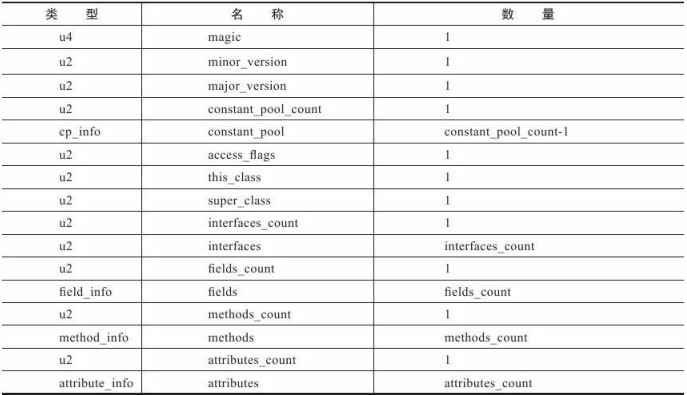

# 参考

深入了解jvm 第三版

java se 12 规范 https://docs.oracle.com/javase/specs/index.html

https://www.cnblogs.com/ysw-go/p/5430218.html

# 类文件结构

## class格式

> java平台无关性的基石——class文件（字节码）

**形式**

以8个字节为基础单位的二进制流，各个数据项目严格按照顺序紧凑地排列在文件之中，中间没有添加任何分隔符。

- 遇到占用8个字节以上空间的数据项时，则会按照高位在前的方式分割成若干个8个字节进行存储

**两种结构类型**

采用伪结构来存储数据

- 无符号数：u1，u2，u4，u8，1、2、4、8个字节的无符号数
  - 描述数字、索引引用、数量之、UTF-8编码构成字符串值

- 表：多个无符号数或其他表构成的符合数据类型
  - 表命名习惯：_info结尾
  - 整个class可以看成一张大表



### 魔数与版本号

**magic 魔数**

0xCAFEBABE

识别class文件，有这个数才能作为class文件被jvm接受

**major_version 主版本号**

jvm规范规定一定要向下兼容，不能向上兼容（即使jdk符合格式也要拒绝）

**minor_version 次版本号**

jdk12之后，一些复杂新特性需要“公测”形式放出，启用了次版本号

如果加入了为写入清单的新功能，次版本号要标识位65535

### 常量池

**constant_pool_count**

容量计数从1开始

0x0001 表十进制的1，代表有0个常量

0x0016 表十进制的22，代表有21个常量

这是因为0x0000，表示不引用任何一个常量池项目

**constant_pool**

两大类

1. 字面量 Literal

   - 接近java的常量概念，文本字符串，被声明为final的常量值

2. 符号引用 Symbolic References

   - 属于编译原理的概念

   - 被模块导出或者开放的包 package

     类和接口的全限定名 Fully Qualified Name

     字段的名称和描述符 Descriptor

     方法的名称和描述符

     方法句柄和方法类型 Method Handle、Method Type、Invoke Dynamic

     动态调用点和动态常量 Dynamically-Computed Call Site、Dynamically-Computed Constant

javac中没有像c、c++有连接这一步骤，而是加载class的时候再动态连接。所以class文件中不会保存各个方法、字段在内存的布局信息，需要jvm运行期转换。所以类加载的时候需要从常量池获得符号引用，类创建时或者运行时解析、翻译到具体内存。

典型常量讲解

**CONSTANT_Class_info类型常量的结构：**

| 类型 | 名称       | 数量 |
| :--- | :--------- | :--- |
| u1   | tag        | 1    |
| u2   | name_index | 1    |

name_index指出了类全限定名在常量池中的偏移

> 书上样例 0x070002 代表第二个常量就是全限定名 
>
> 第二个常量0x01001D........... 代表01代表utf8常量结构 ，001D代表29长度的字符串长 后面跟着这个字符串

- javap -verbose TestClass 可以查看常量表

第一项都是标识位、占一个字节

| 名称            | 项目           | 类型 | 描述                                              |
| -- | -- | -- | -- |
| CONSTANT_Utf8_info               | tag                         | u1   | 1                                                            |
|                                  | length                      | u2   | UTF-8编码的字符串占用的字节数                                |
|                                  | bytes                       | u1   | 长度为length的UTF-8编码的字符串                              |
| CONSTANT_Integer_info            | tag                         | u1   | 3                                                            |
|                                  | bytes                       | u4   | 按照高位在前存储的int值                                      |
| CONSTANT_Float_info              | tag                         | u1   | 4                                                            |
|                                  | bytes                       | u4   | 按照高位在前存储的float值                                    |
| CONSTANT_Long_info               | tag                         | u1   | 5                                                            |
|                                  | bytes                       | u8   | 按照高位在前存储的long值                                     |
| CONSTANT_Double_info             | tag                         | u1   | 6                                                            |
|                                  | bytes                       | u8   | 按照高位在前存储的double值                                   |
| CONSTANT_Class_info              | tag                         | u1   | 7                                                            |
|                                  | index                       | u2   | 指向全限定名的常量项索引                                     |
| CONSTANT_String_info             | tag                         | u1   | 8                                                            |
|                                  | index                       | u2   | 指向字符串字面量的索引                                       |
| CONSTANT_Fieldref_info           | tag                         | u1   | 9                                                            |
|                                  | index                       | u2   | 指向声明字段的类或接口描述符CONSTANT_Class_info的索引项      |
|                                  | index                       | u2   | 指向字段描述符CONSTANT_NameAndType_info的索引项              |
| CONSTANT_Methodref_info          | tag                         | u1   | 10                                                           |
|                                  | index                       | u2   | 指向声明方法的类描述符CONSTANT_Class_info的索引项            |
|                                  | index                       | u2   | 指向名称及类型描述符CONSTANT_NameAndType的索引项             |
| CONSTANT_InterfaceMethodref_info | tag                         | u1   | 11                                                           |
|                                  | index                       | u2   | 指向声明方法的接口描述符CONSTANT_Class_info的索引项          |
|                                  | index                       | u2   | 指向名称及类型描述符CONSTANT_NameAndType的索引项             |
| CONSTANT_NameAndType_info        | tag                         | u1   | 12                                                           |
|                                  | index                       | u2   | 该字段或方法名称的常量项的索引                               |
|                                  | index                       | u2   | 指向该字段或方法描述符常量项的索引                           |
| CONSTANT_MethodHandle_info       | tag                         | u1   | 15                                                           |
|                                  | reference_kind              | u1   | 1至9之间，决定了方法句柄的类型                               |
|                                  | reference_index             | u2   | 值必须是对常量池的有效索引                                   |
| CONSTANT_MethodType_info         | tag                         | u1   | 16                                                           |
|                                  | descriptor_index            | u2   | 值必须是对常量池的有效索引，必须是CONSTANT_Class_info结构，表示方法的描述符 |
| CONSTANT_Dynamic_info            | tag                         | u1   | 17                                                           |
|                                  | bootstrap_method_attr_index | u2   | 值必须是常量池的有效索引，必须是CONSTANT_NameAndType_info结构，表示方法名和方法描述符 |
| CONSTANT_InvokeDynamic_info      | tag                         | u1   | 18                                                           |
|                                  | bootstrap_method_attr_index | u2   | 值必须是当前Class文件中引导方法表的bootstrap_method[]数组的有效索引 |
| CONSTANT_Module_info             | tag                         | u1   | 19                                                           |
|                                  | name_index                  | u2   | 值必须是对常量池的有效索引，必须是CONSTANT_Utf8_info结构，表示模块名称 |
| CONSTANT_Package_info            | tag                         | u1   | 20                                                           |
|                                  | name_index                  | u2   | 值必须是对常量池的有效索引，必须是CONSTANT_Utf8_info结构，表示包名称 |

### 访问标志

**access_flags**

常量池结束之后，紧接着的2个字节代表访问标志(access_flags)，用于标志用于识别一些类或接口层次的访问信息

| 标志名称       | 标志值 | 含义                                                     |
| :------------- | :----- | :------------------------------------------------------- |
| ACC_PUBLIC     | 0x0001 | 是否为public类型                                         |
| ACC_FINAL      | 0x0010 | 是否被final，只有类可设置                                |
| ACC_SUPER      | 0x0020 | 是否允许使用invokespecial字节码指令的新语义              |
| ACC_INTERFACE  | 0x0200 | 标识这是一个接口                                         |
| ACC_ABSTRACT   | 0x0400 | 是否为abstract类型，对于接口或者抽象类为真，其他类型为假 |
| ACC_SYNTHETIC  | 0x1000 | 标识这个类并非由用户代码产生的                           |
| ACC_ANNOTATION | 0x2000 | 标识这是一个注解                                         |
| ACC_ENUM       | 0x4000 | 标识这是一个枚举                                         |
| ACC_MODULE     | 0x8000 | 标识这是一个模块                                         |

### 类索引、父类索引与接口索引的集合

**this class、super class、interfaces_count、interfaces**

类索引 、父类索引都是u2类型数据，interfaces是u2类型数据的集合

java不支持多继承，父类只有一个，Object是所有对象的父类，所以除了Object类所有对象父类索引都有值

它的value对应常量池的偏移

> 比如1，代表第一个常量是类信息表

接口数量、接口同理

接口数量为0，则接口不占任何空间

### 字段表集合

字段

- 作用域 private public protected
- 实例变量、类变量 static
- 可变性 final
- 并发可见性 volatile
- 可否被序列化 transient

**field_info结构**

| 名称             | 类型      | 数量             |
| :--------------- | :-------- | :--------------- |
| access_flags     | u2        | 1                |
| name_index       | u2        | 1                |
| descriptor_index | u2        | 1                |
| attributes_count | 1         |                  |
| attributes       | attribute | attributes_count |

它的访问标识

| 标志名称      | 标志值 | 含义                     |
| :------------ | :----- | :----------------------- |
| ACC_PUBLIC    | 0x0001 | 字段是否public           |
| ACC_PRIVATE   | 0x0002 | 字段是否private          |
| ACC_PROTECTED | 0x0004 | 字段是否protected        |
| ACC_STATIC    | 0x0008 | 字段是否static           |
| ACC_FINAL     | 0x0010 | 字段是否final            |
| ACC_VOLATILE  | 0x0040 | 字段是否volatile         |
| ACC_TRANSIENT | 0x0080 | 字段是否transient        |
| ACC_SYNTHETIC | 0x1000 | 字段是否由编译器自动产生 |
| ACC_ENUM      | 0x4000 | 字段是否enum             |

> 语法规则的约束
>
> 作用域必须三选一 
>
> final、votile只能选一个
>
> 接口的字段 必须有 public static final标志

**name_index**

常量池索引

这里指向的是**简单名称、而非全限定名**

**descriptor_index**

常量池索引

指向方法或字段的**描述符**

> 描述符：描述字段的数据类型、方法的参数列表（数量类型顺序）和返回值
>
> 基本类型 用大写字母表示  对象类型要在后面加上全限定名

| 标识字符 | 含义                             |
| :------- | :------------------------------- |
| B        | byte                             |
| C        | char                             |
| D        | double                           |
| F        | float                            |
| I        | int                              |
| J        | long                             |
| S        | short                            |
| Z        | boolean                          |
| V        | 特殊类型void                     |
| L        | 对象类型，如`Ljava/lang/Object;` |

数组类型每一维会加上前置的"["，如`[[Ljava/lang/String`表示String[][\]

**描述方法时**

()后跟返回值类型，括号内跟参数类型

`void inc()` 	为	`()V`

`([CII[CIII])I`	为	`int indexOf(char[] source,int sourceOffset,int sourceCount,char[] target,char[] target,int targetOffset,int targetCount,int fromindex)`

### 方法表集合

**method_info**

与字段表一致

| 名称             | 类型      | 数量             |
| :--------------- | :-------- | :--------------- |
| access_flags     | u2        | 1                |
| name_index       | u2        | 1                |
| descriptor_index | u2        | 1                |
| attributes_count | 1         |                  |
| attributes       | attribute | attributes_count |

**访问标识**

| 标志名称         | 标志值 | 含义                       |
| :--------------- | :----- | :------------------------- |
| ACC_PUBLIC       | 0x0001 | 是否public                 |
| ACC_PRIVATE      | 0x0002 | 是否private                |
| ACC_PROTECTED    | 0x0004 | 是否protected              |
| ACC_STATIC       | 0x0008 | 是否static                 |
| ACC_FINAL        | 0x0010 | 是否final                  |
| ACC_SYNCHRONIZED | 0x0020 | 是否synchronized           |
| ACC_BRIDGR       | 0x0040 | 是否是编译器产生的桥接方法 |
| ACC_VATARGS      | 0x0080 | 是否接受不定参数           |
| ACC_NATIVE       | 0x0100 | 是否native                 |
| ACC_ABSTRACT     | 0x0400 | 是否abstract               |
| ACC_STRICT       | 0x0800 | 是否strictfp               |
| ACC_SYNTHETIC    | 0x1000 | 是否由编译器自动产生       |

> **strict float point (精确浮点)。**
>
> strictfp 关键字可应用于类、接口或方法。使用 strictfp 关键字声明一个方法时，该方法中所有的float和double表达式都严格遵守FP-strict的限制,符合IEEE-754规范。当对一个类或接口使用 strictfp 关键字时，该类中的所有代码，包括嵌套类型中的初始设定值和代码，都将严格地进行计算。严格约束意味着所有表达式的结果都必须是 IEEE 754 算法对操作数预期的结果，以单精度和双精度格式表示。

**注意点**

父类中没被override的方法不会出现在子类的方法表集合中

<clinit\>()、<init\>()类构造器方法、实例构造器方法会自动添加

在java中、重载需要不同的特征签名、特征签名指一个方法各个参数在常量池字段中字段符号引用的集合，返回值不包括在里面。所以java不支持只有返回值不同的重载。

在class格式中，特征签名的范围更大一点，只要描述符不是完全一致的两个方法就可以共存。

> java语言规范和jvm规范的区别

### 属性表集合

Class文件、字段表、方法表都可以携带自己的属性表集合，描述专有的信息

其他数据项目要求严格顺序、长度和内容不同，属性表不再要求严格顺序，且规范规定只要不与已有属性名重复，任何人实现的编译器都可以向属性表中写入自己定义的属性信息。

**一共29个 javaSE12**

六个属性对于正确地由**Java虚拟机解释类文件**至关重要

| 属性名称         | 使用位置 | 含义                                                         |
| :--------------- | :------- | :----------------------------------------------------------- |
| ConstantValue    | 字段表   | final关键字定义的常量                                        |
| Code             | 方法表   | Java代码编译成的字节码指令                                   |
| StackMapTable    | Code属性 | 供新的类型检查验证器检查和处理目标方法的局部变量和操作数栈所需要的类型是否匹配 |
| BootstrapMethods | 类文件   | 并保存invokeddynamic指令引用的引导方法限定符                 |
| NestHost         | 类       | 支持嵌套类（内部类）的反射和访问控制，内部类通过这个属性知道自己的宿主 |
| NestMembers      | 类       | 宿主类通过这个知道自己有哪些内部类                           |

> invokedynamic指令。这条新增加的指令是JDK 7实现“动态类型语言”（Dynamically Typed Language）支持而进行的改进之一，也是为JDK 8可以顺利实现Lambda表达式做技术准备。

十二个属性对于**通过Java SE平台的类库**正确解释类文件至关重要

| 属性名称                 | 使用位置           | 含义                                                         |
| :----------------------- | :----------------- | :----------------------------------------------------------- |
| `InnerClasses`           | 类文件             | 内部类列表                                                   |
| `EnclosingMethod`        | 类文件             | 仅当一个类为局部类或者匿名类时才能拥有这个属性，这个属性用于标识这个类所在的外围方法 |
| `Synthetic`              | 类、方法表、字段表 | 标识方法或字段为编译器自动生成的                             |
| `Signature`              | 类、方法表、字段表 | 支持泛型下的方法签名。避免类型擦除导致签名混乱。             |
| `SourceFile`             | 类文件             | 记录源文件名称                                               |
| `LineNumberTable`        | Code属性           | java源码的行号与字节码指令的对应关系                         |
| `LocalVariableTable`     | Code属性           | 方法的局部变量描述                                           |
| `LocalVariableTypeTable` | 类                 | 使用特征签名代替描述符，能描述泛型参数化类型而添加           |
| `Exceptions`             | 方法表             | 方法抛出的异常列表                                           |

> 局部类和匿名类详见：https://www.cnblogs.com/ysw-go/p/5430218.html、一个是new 中重写（匿名类，一个不同的类，但是没有名字）、一个定义一个新的类在方法内部（方法内可见方法外不可见）
>
> 类型擦除是指泛型在运行的时候会去除泛型的类型信息。java 中，泛型主要是在编译层次来实现的，在生成的字节码即 class 文件是不包括泛型的 类型信息的。 即 List， List ，List 虽然在编译时候是不同的，但是在编译完成后，在class 文件 中都只会把他们当作 List 来对待。
>
> Parent<T\>是一个泛型类型，它的参数范围是从顶层类型Object向下到任意一个类型。Parent<Integer>不是泛型，它是ParameterizedType

十三个属性对于Java虚拟机对类文件的正确解释不是至关重要的，而是包含有关类文件的元数据，这些元数据可以由Java SE Platform的类库公开，也可以由工具提供

| 属性名称               | 使用位置           | 含                     |
| :--------------------- | :----------------- | :--------------------- |
| `SourceDebugExtension` | 类文件             | 存储额外的调试信息     |
| `Deprecated`           | 类、方法表、字段表 | 被声明国企的方法和字段 |
| `RuntimeVisibleAnnotations`            | 类、方法表、字段表         | 并保存invokeddynamic指令引用的引导方法限定符                 |
| `RuntimeInvisibleAnnotations`          | 类、方法表、字段表         | 运行时不可见的注解                                           |
| `RuntimeVisibleParameterAnnotations`   | 方法表                     | 运行时可见的参数注解                                         |
| `RuntimeInvisibleParameterAnnotations` | 方法表                     | 运行时不可见的参数注解                                       |
| `RuntimeVisibleTypeAnnotations`        | 类、方法表、字段表、code表 | 类型注解、运行时可见                                         |
| `RuntimeInvisibleTypeAnnotations`      | 类、方法表、字段表、code表 | 类型注解、运行时不可见                                       |
| `AnnotationDefault`                    | 方法表                     | 记录注解类元素的默认值                                       |
| `MethodParameters`                     | 方法表                     | 支持将方法名称编译进Class文件中，并运行时可获取（编译时加上-parameters）。此前只能通过javadoc获取 |
| Module                                 | 类                         | 记录一个module名称、requires、exports、opens、uses、provides |
| ModulePackages                         | 类                         | 记录一个模块所有被exports或open的包                          |
| ModuleMainClass                        | 类                         | 指定一个模块的朱磊                                           |

对于每一个属性都要从常量池引用一个CONSTANT_Utf8_info类型的常量拉标识，而属性值的结构则是完全自定义的

属性的结构时完全自定义的，需要一个u4的长度属性说明占用位数

```c
attribute_info {
    u2 attribute_name_index;
    u4 attribute_length;
    u1 info[attribute_length];
}
```

**Code 属性**

方法体的代表编译后的字节码存在这，抽象类、接口类由于没有代码不存在Code属性

```c
Code_attribute {
    u2 attribute_name_index;
    u4 attribute_length;
    u2 max_stack;//操作数栈深度的最大值
    u2 max_locals;//局部变量表存储的空间 jvm自动将超出作用域的变量的变量槽再分配使用
    u4 code_length;//这里u4，实际超过u2个字节码就回报错，规范定的
    u1 code[code_length];
    u2 exception_table_length;//异常表 区别属性表里的exceptions
    {   u2 start_pc;
        u2 end_pc;
        u2 handler_pc;
        u2 catch_type;
    } exception_table[exception_table_length];
    u2 attributes_count;
    attribute_info attributes[attributes_count];
}
```

> 变量槽slot 存储的最小单位 byte char float int 不超过32的占一个 double long占两个slot
>
> code 实例方法的参数默认有个reference （用来实现this）， static的方法就没有

**Exceptions**

```
Exceptions_attribute {
    u2 attribute_name_index;
    u4 attribute_length;
    u2 number_of_exceptions;
    u2 exception_index_table[number_of_exceptions];
}
```

每种受查异常由一个exception_index_table项表示

**LineNumberTable**

```c
LineNumberTable_attribute {
    u2 attribute_name_index;
    u4 attribute_length;
    u2 line_number_table_length;
    {   u2 start_pc;
        u2 line_number;	
    } line_number_table[line_number_table_length];
}
```

line_number_table每一项包含 start_pc 和 line_number，前者字节码行号、后者java行号

**LocalVariableTable 和 LocalVariableTypeTable**

用于描述栈帧中局部变量和java源码定义变量的关系，不是必须，但默认会生成到java中，-g:none取消 -g:vars来生产

> 关闭会导致其他人引用方法的时候所有参数名称丢失，比如ide会用arg0、arg1代替参数，十分不便

```c
LocalVariableTable_attribute {
    u2 attribute_name_index;
    u4 attribute_length;
    u2 local_variable_table_length;//代表了一个栈帧与源码中局部变量的关联
    {   u2 start_pc;//生命周期开始的字节码偏移量
        u2 length;//作用范围覆盖的长度
        u2 name_index;
        u2 descriptor_index;
        u2 index;//栈帧局部变量表中变量槽的位置，占两个槽 index index+1
    } local_variable_table[local_variable_table_length];
}
```

为了支持泛型 LocalVariableTypeTable 将上述的descriptor_index替换成了字段的特征签名

**SourceFile 及 SourceDubugExtension**

`-g:none -g:source`

对于大部分类，文件名类名一直，但是对于内部类，每生成这个属性会定位不到出错的文件名

```c
SourceFile_attribute {
    u2 attribute_name_index;
    u4 attribute_length;
    u2 sourcefile_index;
}
//一个类只有一个 用来存储非java语言的调试信息，典型例子：jsp的行号
SourceDebugExtension_attribute {
    u2 attribute_name_index;
    u4 attribute_length;
    u1 debug_extension[attribute_length];
}
```

**ConstantValue**

实例变量在实例构造器 <init\>()初始化

类变量如果同时又final和static则用ConstantValue初始化，只有static使用类构造器<clinit\>()初始化

```c
SourceFile_attribute {
    u2 attribute_name_index;
    u4 attribute_length;
    u2 constantvalue_index;
    //常量池又 constantvalue_info
}
```

**InnerClass**

```java
InnerClasses_attribute {
    u2 attribute_name_index;
    u4 attribute_length;
    u2 number_of_classes;
    {   u2 inner_class_info_index;//内部类
        u2 outer_class_info_index;//宿主类
        u2 inner_name_index;//匿名内部类，其值访问为0
        u2 inner_class_access_flags;//内部类访问标识、类似类标识
    } classes[number_of_classes];
}
```

**Deprecated 和 Synthetic**

标识过期的不用说

Synthetic 或者 ACC_SYNTHETIC 至少有一个需要使用

编译器实现的自动编译代码实现了越权访问（比如越过private），术语早期优化的技巧

> 典型例子：自动生成枚举元素数组和嵌套类的桥接方法

不属于用户代码的都要设置这个，除了<init\>()和<clinit\>()

**StackMapTable**

```java
StackMapTable_attribute {
    u2              attribute_name_index;
    u4              attribute_length;
    u2              number_of_entres
    //栈映射帧、显示或隐式代表了一个字节码偏移量来验证类型
    stack_map_frame entries[number_of_entries];
hi'zh一直}
```

字节码验证器，省略了在运行期通过数据流分析确认字节码的行为逻辑合法性步骤

在编译阶段将一系列的验证类型直接记录在Class文件之中，代替类型推导。

**Signature**

可选的定长属性，可以出现类、字段表和方法表结构的属性表中。

出现类型变量或参数化类型的时候，要记录泛型签名信息

java泛型的实现时擦除法实现的伪泛型，字节码code属性中所有的泛型信息编译会被编译后统统擦除掉，非常容易实现Backport，但**无法像C#等真泛型一样，反射无法获得泛型信息。Signature就是为了弥补这个机制出现的**。

```java
Signature_attribute {
    u2 attribute_name_index;
    u4 attribute_length;
    u2 signature_index;//索引一个utf8_info，类签名、字段签名、方法签名
}
```

**BootstrapMethods**

保存invokedynamic指令引用的引导方法限定符

到执行引擎部分再细讲

```c
BootstrapMethods_attribute {
    u2 attribute_name_index;
    u4 attribute_length;
    u2 num_bootstrap_methods;
    {   u2 bootstrap_method_ref;//常量池的一个CONSTANT_MethodHandle_info结构
        u2 num_bootstrap_arguments;//参数数量
        u2 bootstrap_arguments[num_bootstrap_arguments];//参数列表
    } bootstrap_methods[num_bootstrap_methods];
}
```

**MethodParameter**

保存局部变量名称信息（方便传播、调用）

但是由于LocalVariableTable是code子属性，没有方法区就不会有（抽象类、接口类就记录不到了）

就有了这个结构，方法表的属性，与code属性平级，运行时可以通过反射API获取

```c
MethodParameters_attribute {
    u2 attribute_name_index;
    u4 attribute_length;
    u1 parameters_count;
    {   u2 name_index;
        u2 access_flags;
    } parameters[parameters_count];
}
```

**模块化相关属性**

模块描述文件（module-info.java）最终编译成一个独立的Class文件来存储的，所以，Class文件格式也扩展Module，ModulePackages和ModuleMainClass三个属性用于支持Java模块化相关功能

Module属性，模块名称、ins、uses、provides

s1ss

