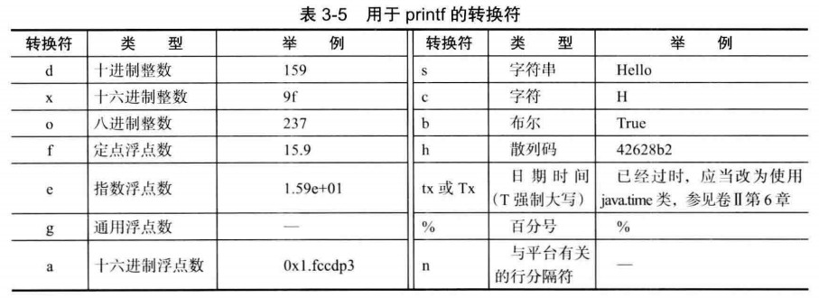
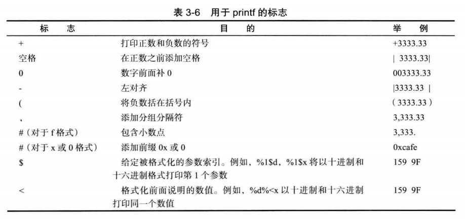
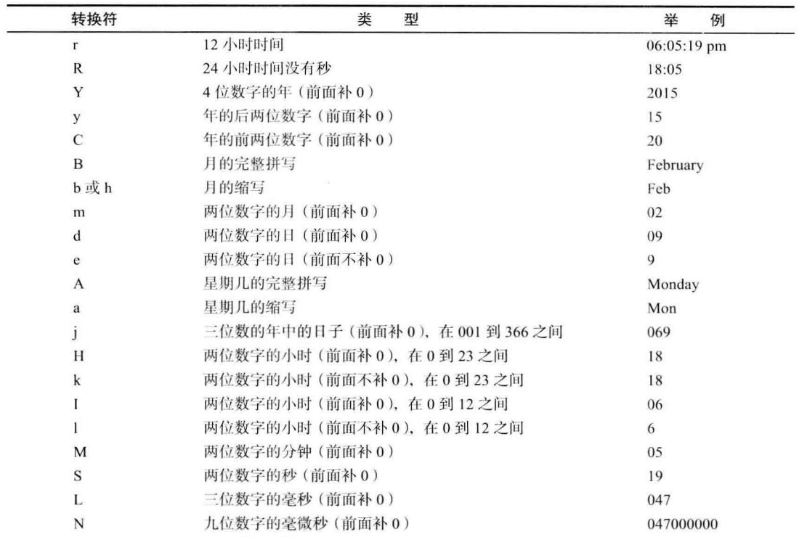

# 1.java基本程序设计结构

## 1.1简单应用程序，main函数

```java
public class ClassName
{
	public static void main(String[] args){
		program statements
	}
}
```

1. 关键字 public 称为**访问修饰符**（access modifier ) 
2. **类名命名规则**：字必须以字母开头，后面可以跟字母和数字的任意组合。长度基本上没有限制。但是不能使用 Java 保留字（例如，public 或 class) 作为类名，大小写敏感
3. **类名命名规范**：每个单词的第一个字母都应该大写（这种在一个单词中间使用大写字母的方式称为骆驼命名法。 
4. **源代码的文件名必须与公共类的名字相同**，并用.java 作为扩展名。因此，存储这段源代码的文件名必须为 ClassName.java 

5. main方法是**程序的入口**，而且**必须用public修饰**

## 1.2注释

**单行注释**：//

**长篇注释**：/* statements */

**自动生成文档注释的长篇注释**：/** + 回车自动生成

> /* */无法嵌套使用

## 1.3数据类型

Java 是一种**强类型语言**。这就意味着必须**为每一个变量声明一种类型**

Java 中，共有 **8 种基本类型** （ primitive type ), 其中有 **4 种整型**、**2 种浮点类型**、 **1 种用于表示 Unicode 编码的字符单元的字符类型 char** (请参见论述 char 类型的章节）和 **1 种用于表示真值的 boolean 类型**。 

Java 有一个能够**表示任意精度的算术包**，通常称为“ 大数值”（bignumber。) 虽然
被称为大数值，但它并不是一种新的 Java 类型， 而是**一个 Java 对象**。 

### 1.3.1整型

| 类型  | 存储需求 | 取值范围                                               |
| ----- | -------- | ------------------------------------------------------ |
| int   | 4 字节   | -2 147 483 648 ~ 2 147 483 647 (正好超过 20 亿)        |
| short | 2 字节   | -32 768 ~ 32 767                                       |
| long  | 8 字节   | -9 223 372 036 854 775 B08 ~ 9 223 372 036 854 775 807 |
| byte  | 1字节    | -128 ~ 127                                             |

在 Java 中， **整型的范围与运行 Java 代码的机器无关**。 所以各种数据类型的取值范围必须固定。 

**长整型数值有一个后缀 L 或 1** ( 如 4000000000L。) 

**十六进制数值有一个前缀 Ox 或 0X** (如OxCAFEL 

**八进制有一个前缀 0** , 例如， 010 对应八进制中的 8。 很显然， 八进制表示法比较容易混淆， 所以建议最好不要使用八进制常数。
从 Java 7 开始， **加上前缀 0b 或 0B 就可以写二进制数**。 例如，OblOO丨就是 9。

另外，同样是从 Java 7 开始，**还可以为数字字面量加下划线**， 如用 1_000_000 表示一百万。这些**下划线只是为让人更易读**。Java 编译器会去除这些下划线 

> 注意 Java **没有任何无符号（unsigned) 形式的 int、 long、 short 或 byte** 类型。 

### 1.3.2浮点类型

| 类型   | 存储需求 | 取值范围                                                |
| ------ | -------- | ------------------------------------------------------- |
| float  | 4 字节   | 大约 ± 3.402 823 47E+38F (有效位数为 6 ~ 7 位）         |
| double | 8 字节   | 大约 ± 1.797 693 134 862 315 70E+308 (有效位数为 15 位> |

**float 类型的数值有一个后缀 F 或 f** (例如， 3.14F)。

**没有后缀 F 的浮点数值（如 3.14 ) 默认为 double 类型**。当然，也可以**在浮点数值后面添加后缀 D 或 d** (例如，3.14D) 

可以使用**十六进制表示浮点数值**。例如，0.125=2^—3 可以表示成 **0xl.0p-3**。在十六进制表示法中， **使用 p 表示指数， 而不是 e**。 注意， 尾数采用十六进制， 指数采用十进制。**指数的基数是 2， 而不是 10**。 

> 在很多情况下，float 类型的精度很难满足需求。实际上，**只有很少的情况适合使用 float 类型**，例如，需要**单精度数据的库**， 或者**需要存储大量数据**。 
>
> double 表示这种类型的数值精度是 float 类型的两倍（有人称之为**双精度数值**) 
>
> 如果在数值计算中不允许有任何舍入误差 ，需要用BigDemical，不能用浮点数

**表示溢出和出错情况的三个特殊的浮点数值**：正无穷大、负无穷大、NaN (不是一个数字） 

> **正整数除以 0 的结果为正无穷大。计算 0/0 或者负数的平方根结果为 NaN** 
>
> 常量 Double_POSITIVE_INFINITY、Double.NEGATIVEJNFINITY 和 Double.NaN( 以及相应的 Float 类型的常量）分别表示这三个特殊的值， 但在实际应用中很少遇到 
>
> 所有**“ 非数值” 的值都认为是不相同**的。 
>
> - if (x = Double.NaN) // is never true **不正确的用法**
> - if (Double.isNaN(x)) // check whether x is "not a number" 

### 1.3.3char类型

char 类型原本用于表示单个字符。不过，现在情况已经有所变化。 如今，**有些 Unicode 字符可以用一个 char值描述， 另外一些 Unicode 字符则需要两个 char 值**。 

char 类型的值可以表示为十六进制值，其范围从 \u0000 到 \Uffff 。

**\u本质是转义序列**

```java
public static void main(String\u005B\u00SD args)
public static void main(String[] args)
//两者同义
```

| 转义序列          | 名称   | Unicode 值 |
| ----------------- | ------ | ---------- |
| \b                | 退格   | \u0008     |
| \t                | 制表   | \u0009     |
| \n                | 换行   | \u000a     |
| \r                | 回车   | \u000d     |
| \\"               | 双引号 | \u0022     |
| \\' 单引号 \u0027 | 单引号 | \u0027     |
| \\\\              | 反斜杠 | \u005c     |

> **Unicode 转义序列会在解析代码之前得到处理**。 **包括注释内**的转义序列
>
> - “\u0022+\u0022” 
>
>   为""+"" 两个空串的拼接
>
>   并不是  “+” 的字符串 
>
> - // \u00A0 is a newline
>
>   替换为换行符之后，就到下一行了，单行注释失败
>
> - // Look inside c:\users
>
>   错误转义了 应该是c:\\\\users 防止错误

### 1.3.4Unicode 和 char 类型

**ASCII 编码**

早期人们用8位二进制来编码英文字母(最前面的一位是0)，也就是说，将英文字母和一些常用的字符和这128中二进制0、1串一一对应起来，比如：大写字母“A”所对应的二进制位“01000001”，转换为十六进制为41。

在美国，这128是够了，但是其他国家不够，他们的字符和英文是有出入的，比如在法语中在字母上有注音符号，如 é 。所以各个国家就决定把字节中最前面未使用的那一个位拿来使用，原来的128种状态就变成了256种状态，比如é就被编码成130（二进制的10000010）。

为了保持与ASCII码的兼容性，一般最高位为0时和原来的ASCII码相同，最高位为1的时候，各个国家自己给后面的位(1xxx xxxx)赋予他们国家的字符意义。

但是这样一来又有问题出现了，不同国家对新增的128个数字赋予了不同的含义，比如说130在法语中代表了é,但是在希伯来语中却代表了字母Gimel

 所以这就成了不同国家有不同国家的编码方式，所以如果给你一串二进制数，想要解码，就必须知道它的编码方式，不然就会出现我们有时候看到的乱码 。Unicode的出现是为了解决这个问题

**Unicode码**
Unicode为世界上所有字符都分配了一个唯一的数字编号，这个**编号范围从 0x000000 到 0x10FFFF(十六进制)**，有110多万，每个字符都有一个唯一的Unicode编号，这个编号一般写成16进制，在前面加上U+。

**码点** （ code point ) 是指与一个编码表中的某个字符对应的代码值。 在 Unicode 标准中，码点采用十六进制书写，并加上前缀 U+, 例如 U+0041 就是拉丁字母 A 的码点。

 Unicode 的码点可以分成 17 个**代码级别** （codeplane)。第一个代码级别称为**基本的多语言级别** （basic
multilingual plane ), 码点从 U+0000 到 U+FFFF, 其中包括经典的 Unicode 代码；其余的 16
个级别码点从 U+10000 到 U+10FFFF , 其中包括一些辅助字符（supplementary character)。

**Unicode就相当于一张表，建立了字符与编号之间的联系**。它是一种规定，**Unicode本身只规定了每个字符的数字编号是多少，并没有规定这个编号如何存储。**实现方案，主要有**UTF-8，UTF-16，UTF-32**。（UTF-8、UTF-16、UTF-32……都是 Unicode编码 的一种实现。）

1、**UTF-32** 

这个就是字符所对应编号的整数二进制形式，**四个字节**，这个就是直接转换。 比如：马的Unicode为：U+9A6C，那么直接转化为二进制，它的表示就为：1001 1010 0110 1100。

注意：转换成二进制后计算机存储的问题。计算机在存储器中排列字节有两种方式：大端法和小端法，大端法就是将高位字节放到底地址处，比如0x1234, 计算机用两个字节存储，一个是高位字节0x12,一个是低位字节0x34，它的存储方式为下：

我们可以根据他们高低字节的存储位置来判断他们所代表的含义，所以在编码方式中有 **UTF-32BE 和 UTF-32LE ，分别对应大端和小端**，来正确地解释多个字节（这里是四个字节）的含义。

2、**UTF-16** 

UTF-16使用变长字节表示 

① 对于编号在U+0000到U+FFFF的字符（常用字符集），直接用两个字节表示。 
② 编号在 U+10000到U+10FFFF之间的字符，需要用四个字节表示。

UTF-16 编码采用不同长度的编码表示所有 Unicode 码点。在基本的多语言级别中，每个字符用 16 位表示，通常被称为代码单元（code unit) ; 而辅助字符采用一对连续的代码单元进行编码。这样构成的编码值落人基本的多语言级别中空闲的 2048 字节内， **通常被称为替代区域（surrogate area) [ U+D800 ~ U+DBFF 用于第一个代码单兀，U+DC00 ~ U+DFFF 用于第二个代码单元]**。这样设计十分巧妙， 我们可以从中迅速地知道一个代码单元是一个字符的编码，还是一个辅助字符的第一或第二部分。 

**码点转化为上述的两个代码单元是有个算法的，不作要求理解**

同样，UTF-16 也有字节的顺序问题（大小端），所以就有UTF-16BE表示大端，UTF-16LE表示小端。

3、**UTF-8** 

UTF-8就是使用变长字节表示,顾名思义，就是使用的字节数可变，这个变化是根据 Unicode 编号的大小有关，编号小的使用的字节就少，编号大的使用的字节就多。使用的字节个数从1到4个不等。

有个对应表供转换

> **在 Java 中，char 类型描述了 UTF-16 编码中的一个代码单元。我们强烈建议不要在程序中使用 char 类型， 除非确实需要处理 UTF-16 代码单元。最好将字符串作为抽象数据类型处理。**

### 1.3.5boolean 类型

boolean (布尔）类型有两个值：false 和 true, 用来判定逻辑条件，**整型值和布尔值之间不能进行相互转换**。 

## 1.4变量

```java
//变量声明
double salary;
int vacationDays;
long earthPopulation;
boolean done;
int i, j; // both are integers
```

**变量名**必须是一个**以字母开头并由字母或数字构成的序列**。 

Java 中**“ 字母” 和“ 数字” 的范围更大**。’A’ ~ ’Z’、 ’a‘ ~ ’z’、‘_’、‘$’ 或数字或在某种语言中表示字母的任何 Unicode 字符。例如希腊人可以用 pi 。同样， 数字包括 '0' ~ '9’ 和在某种语言中表示数字的任何 Unicode 字符。并且**大小写敏感。变量名的长度基本上没有限制。 不能为保留字。**

> 如果想要知道哪些 Unicode 字符属于 Java 中的“ 字母”， 可以使用 Character 类的isJavaldentifierStart 和 isJavaldentifierPart 方法来检查。 
>
> 尽管 $ 是一个合法的 Java 字符， 但不要在你自己的代码中使用这个字符。 它只用
> 在 Java 编译器或其他工具生成的名字中。 

### 1.4.1变量初始化

声明一个变量之后，必须**用赋值语句对变量进行显式初始化**， 千万不要使用未初始化的变量。 

在 Java 中， **变量的声明尽可能地靠近变量第一次使用的地方**， 这是一种良好的程序编写风格。

在 Java 中， **不区分变量的声明与定义。** 只有声明和初始化。

```java
//分开
int vacationDays;
vacationDays = 12;
//一起写
int vacationDays = 12;
```

### 1.4.2常量

关键字 **final** 表示这个变量**只能被赋值一次**。一旦被赋值之后， 就不能够再更改了。

**习惯上,常量名使用全大写。** 

```java
public class Constants
{
	public static void main(String[] args)
	{
		final double CM_PER_INCH = 2.54;
		double paperWidth = 8.5;
		double paperHeight = 11;
		System,out.println("Paper size in centimeters: "
		+ paperWidth * CM PER INCH + " by " + paperHeight * CM.PER.INCH);
	}
}
```

经常希望某个常量可以在一个类中的多个方法中使用，通常将这些常量称为类常量。可以使用关键字 static final设置一个类常量。 

类常量的定义位于 main 方法的外部。 因此， 在同一个类的其他方法中也可以使用这个常量。 而且， 如果一个常量被声明为 public， 那么其他类的方法也可以使用这个常量。 

```java
public class Constants
{
	public static final double CM_PER_INCH = 2.54;
	public static void main(Stringn args)
	{
		double paperWidth = 8.5;
		double paperHeight = 11;
		System.out.println("Paper size in centimeters: "
		+ paperWidth * CMJERJNCH + " by " + paperHeight * CM_PER_INCH) ;
	}
}
```

> const 是 Java 保留的关键字， 但目前并没有使用。 在 Java 中， 必须使用 final定义常量。 

## 1.5运算符

不同处理器的不同寄存器位数不同，导致浮点数精度不同。

因此，Java 虚拟机的最初规范规定所有的中间计算都必须进行截断这种行为遭到了数值计算团体的反对。
截断计算不仅可能导致溢出， 而且由于截断操作需要消耗时间， 所以在计算速度上实际上要比精确计算慢。 为此， Java 程序设计语言承认了最优性能与理想结果之间存在的冲突，并给予了改进。在默认情况下， 虚拟机设计者允许对中间计算结果采用扩展的精度。

但也可以**使用strictfp**， 在 **main 方法中的所有指令都将使用严格的浮点计算**。如果**将一个类标记为strictfp, 这个类中的所有方法都要使用严格的浮点计算**。 

```java
public static strictfp void main(String[] args)
```

在默认情况下，中间结果允许使用扩展的指数， 但不允许使用扩展的尾数（Intel 芯片在截断尾数时并不损失性能，所以可以无条件截断）。 因此，这两种方式的**区别仅仅在于采用默认的方式不会产生溢出， 而采用严格的计算有可能产生溢出**。 

### 1.5.1数学函数和常量

```java
//平方根
double x = 4;
double y = Math.sqrt(x);
System.out.println(y); // prints 2.0
//幂计算，返回值参数都是double
double y = Math.pow(x, a);
//取余运算 a+c / b 的余数 ，且一定在0~b中，若b<0,则为b~0中
int a = 7;
int b = 6;
int c = 9;
int i = floorMod(a + c, b) 
//Math 类提供了一些常用的三角函数：
Math.sin
Math.cos
Math.tan
Math.atan
Math.atan2
//还有指数函数以及它的反函数—自然对数以及以 10 为底的对数：
Math.exp
Math.log
Math.logl0
//最后，Java 还提供了两个用于表示 TC 和 e 常量的近似值：
Math.PI
Math.E
```

> 在 Math 类中， 为了达到最快的性能， 所有的方法都使用计算机浮点单元中的例程。**如果得到一个完全可预测的结果比运行速度更重要的话， 那么就应该使用 StrictMath类**, 它使用“ 自由发布的 Math 库”（**fdlibm**) 实现算法， 以确保在所有平台上得到相同的结果

### 1.5.2数值类型的转换

6 个实心箭头，表示无信息丢失的转换； 有 3 个虚箭头， 表示可能有精度损失的转换。 


**当使用上面两个数值进行二元操作**时（例如 n + f， n 是整数， f 是浮点数，) 先要将两个操作数转换为同一种类型，然后再进行计算。

1. 如果两个操作数中有一个是 double 类型， 另一个操作数就会转换为 double 类型。
2. 否则， 如果其中一个操作数是 float 类型， 另一个操作数将会转换为 float 类型。
3. 否则， 如果其中一个操作数是 long 类型， 另一个操作数将会转换为 long 类型。
4. 否则， 两个操作数都将被转换为 int 类型。 

### 1.5.3强制类型转换

在必要的时候， int 类型的值**将会自动地转换**为 double 类型。但另一方面，有时也需要将 double 转换成 int。 

在这种情况下，需要通过**强制类型转换 （ cast) 实现这个操作**。强制类型转换的语法格式是在圆括号中给出想要转换的目标类型，后面紧跟待转换的变量名。 

```java
double x * 9.997;
int nx = (int) x;
//取最接近整数
int nx = (int) Math.round(x);
//当调用 round 的时候， 仍然需要使用强制类型转换（ int)。其原因是 round 方法返回的结果为 long 类型，由于存在信息丢失的可能性
```

### 1.5.4结合运算符

```java
X += 4;
//一般地， 要把运算符放在= 号左边， 如 *= 或 ％=
//如果运算符得到一个值， 其类型与左侧操作数的类型不同， 就会发生强制类型转换。
x += 3.5;//将把 X 设置为（int)(x + 3.5)
```

### 1.5.5自增与自减运算符

```java
n++;//先算后加
++n;//先
```

### 1.5.6关系和boolean运算符

```java
3 == 7	//false
3 != 7	//true
```

最后， 还有经常使用的 < (小于、) > (大于)、<= (小于等于）和 >= (大于等于）运算符。
Java 沿用了 C++ 的做法，使用 && 表示逻辑“ 与” 运算符，使用|| 表示逻辑“ 或” 运算符。从 != 运算符可以想到，感叹号！就是逻辑非运算符。**&& 和||运算符是按照“ 短路” 方式来求值的： 如果第一个操作数已经能够确定表达式的值，第二个操作数就不必计算了**。

最后一点，Java 支持三元操作符？：，这个操作符有时很有用。如果条件为 true, 下面的表达式

```java
condition ? expression : expression ;
```

### 1.5.7位运算符

& ("and") | ("or") ^ ("XOr") ~ ("not") 

**不采用短路法则**

还有 << 和  >> 运算符将位模式左移和算术右移（高位补符号位）。  

\>\>>逻辑右移（高位补0）

```java
//移位运算符的右操作数要完成模 32 的运算（除非左操作数是 long 类型， 在这种情况下需要对右操作數模64 )
3 << 35
3 << 3
//上两者相等
```

### 1.5.8括号与运算符优先级


### 1.5.9枚举类型

有时候，变量的取值只在一个有限的集合内。 例如： 销售的服装或比萨饼只有小、中、大和超大这四种尺寸。当然， 可以将这些尺寸分别编码为 1、2、3、4 或 S、 M、 L、X。但这样存在着一定的隐患。 在变量中很可能保存的是一个错误的值（如 0 或 m)。 

**针对这种情况， 可以自定义枚举类型**。 

```java
enum Size { SMALL, MEDIUM, LARGE, EXTRA .LARCE };
Size s = Size.MEDIUM;
//Size 类型的变量只能存储这个类型声明中给定的某个枚举值， 或者 null 值，null 表示这个变量没有设置任何值
```

## 1.6字符串

```java
String greeting = "Hello";
//子串
String s = greeting.substring(0, 3);
//拼接
String expletive = "Expletive";
String PC13 = "deleted";
String message = expletive + PC13;
//任何类型拼接时都会被转换为字符串
int age = 13;
String rating = "PC" + age;
//用某字符串作为分隔来拼接
如果需要把多个字符串放在一起， 用一个定界符分隔，可以使用静态 join 方法：
String all = String.join(" / ", "S", "M", "L", "XL");// string "S / H / L / XL"
//检测相等,永远不要用==判断字符串相等
s.equals(t);
"Hello".equals(greeting)
"Hello".equalsIgnoreCase("hel1o");//忽略大小写判断相等
if (greeting.compareTo("Hello") == 0);//类似c++的用法，不够直观
//空串 注意不等于null
//是长度为 0 的字符串。可以调用以下代码检查一个字符串是否为空：
if (str.length() = 0);
if (str.equals(""));
//字符串为null
if (str == null)
```

由于不能修改 Java 字符串中的字符， 所以在 **Java 文档中将 String 类对象称为不可变字符串** 

> Java 字符串大致类似于 char* 指针 
>
> Java 自带gc

**java 字符串由 char 值序列组成。**从 3.3.3 节“ char 类型” 已经看到， char 数据类型是一
个采用 UTF-16 编码表示 Unicode 码点的代码单元。大多数的常用 Unicode 字符使用一个代
码单元就可以表示，而辅助字符需要一对代码单元表示。 

```java
//length 方法将返回采用 UTF-16 编码表示的给定字符串所需要的代码单元数量。
String greeting = "Hello";
int n = greeting.length(); // is 5 .
//要想得到实际的长度，即码点数量，可以调用。大于等于上者（UTF-16一个码点/两个码点标识一个字符）
int cpCount = greeting.codePointCount(0, greeting.length());
//调用 s.charAt(n) 将返回位置 n 的代码单元，n 介于 0 ~ s.length()-l 之间。例如：
char first = greeting.charAt(O); // first is 'H'
char last = greeting.charAt(4); // last is ’o’
//要想得到第 i 个码点，应该使用下列语句
int index = greeting.offsetByCodePoints(0,i);//找出第i个码点的第一个代码单元位置
int cp = greeting.codePointAt(index);//这里的index是代码单元的索引

//如果想要遍历一个字符串，并且依次査看每一个码点， 可以使用下列语句：
int cp = sentence.codePointAt(i);
if (Character.isSupplementaryCodePoint(cp))i += 2;
else i++;
//可以使用下列语句实现回退操作：
i--；
if (CharacterssSurrogate(sentence.charAt(i))) i-- ;
int cp = sentence.codePointAt(i);
//上两种遍历十分不方便
//容易的办法是使用 codePoints 方法， 它会生成一个 int 值的“ 流”，每个 int 值对应一个码点。
int[] codePoints = str.codePointsO.toArray()；
//反之， 要把一个码点数组转换为一个字符串， 可以使用构造函数
String str = new String(codePoints, 0, codePoints.length) ;
```

有些时候， 需要由较短的字符串构建字符串， 例如， 按键或来自文件中的单词。采用字
符串连接的方式达到此目的效率比较低。 每次连接字符串， 都会构建一个新的 String 对象，
既耗时， 又浪费空间。**使用 StringBuilder类就可以避免这个问题的发生**。 

```java
//建一个空的字符串构建器：
StringBuilder builder = new StringBuilder();
//当每次需要添加一部分内容时， 就调用 append 方法。
builder.append(ch); // appends a single character
bui1der.append(str); // appends a string
//在需要构建字符串时就凋用 toString 方法， 将可以得到一个 String 对象， 其中包含了构建器
中的字符序列。
String completedString = builder.toString();
```

常用**StringAPI**

- char charAt (int index)
  返回给定位置的代码单元。除非对底层的代码单元感兴趣， 否则不需要调用这个
  方法。

- int codePointAt(int Index) 5.0
  返回从给定位置开始的码点。
- int offsetByCodePoints(int startlndex, int cpCount) 5.0
  返回从 startlndex 代码点开始，位移 cpCount 后的码点索引。
- int compareTo(String other)
  按照字典顺序， 如果字符串位于 other 之前， 返回一个负数；如果字符串位于 other 之
  后，返回一个正数； 如果两个字符串相等，返回 0。
- IntStream codePoints() 8
  将这个字符串的码点作为一个流返回。调用 toArray 将它们放在一个数组中。
- new String(int[] codePoints, int offset, int count) 5.0
  用数组中从 offset 开始的 count 个码点构造一个字符串。
- boolean equals(0bject other)
  如果字符串与 other 相等， 返回 true 

- boolean equalsIgnoreCase( String other )
  如果字符串与 other 相等 （忽略大小写，) 返回 tme。
- boolean startsWith( String prefix )
- boolean endsWith( String suffix )
  如果字符串以 suffix 开头或结尾， 则返回 true。
- int indexOf ( String str )
- int indexOf( String str, int fromlndex )
- int indexOf ( int cp)
- int indexOf( int cp, int fromlndex )
  返回与字符串 str 或代码点 cp 匹配的第一个子串的开始位置。这个位置从索引 0 或
  fromlndex 开始计算。 如果在原始串中不存在 str， 返回 -1。
- int lastIndexOf( String str )
- Int lastIndexOf ( String str, int fromlndex )
- int lastindexOf( int cp)
- int lastindexOf( int cp, int fromlndex )
  返回与字符串 str 或代码点 cp 匹配的最后一个子串的开始位置。 这个位置从原始串尾
  端或 fromlndex 开始计算。
- int 1ength( )
  返回字符串的长度。
- int codePointCount( int startlndex, int endlndex ) 5.0
  返回 startlndex 和 endludex-l 之间的代码点数量。没有配成对的代用字符将计入代码点
- String replace( CharSequence oldString,CharSequence newString)
  返回一个新字符串。这个字符串用 newString 代替原始字符串中所有的 oldString。可
  以用 String 或 StringBuilder 对象作为 CharSequence 参数。
- String substring( int beginlndex )
- String substring(int beginlndex, int endlndex )
  返回一个新字符串。这个字符串包含原始字符串中从 beginlndex 到串尾或 endlndex-l
  的所有代码单元。
- String toLowerCase( )
- String toUpperCase( )
  返回一个新字符串。 这个字符串将原始字符串中的大写字母改为小写，或者将原始字
  符串中的所有小写字母改成了大写字母。
- String trim( )
  返回一个新字符串。这个字符串将删除了原始字符串头部和尾部的空格。
- String join(CharSequence delimiter, CharSequence... elements ) 8
  返回一个新字符串， 用给定的定界符连接所有元素。 

## 1.7输入输出

### 1.7.1读取输入

```java
import java.util.*;
......
Scanner in = new Scanner(System.in);
System.out.print("What is your name? ");
String name = in.nextLine();
System.out.print("How old are you? ")；
int age = in.nextlnt();
System.out.print("How tall are you? ")；
double tall = in.nextDouble();
//还有next() hasNext() hasNextInt() hasNextDouble() 
```

因为输入是可见的， 所以 **Scanner 类不适用于从控制台读取密码**。Java SE 6 特别引入了 Console 类实现这个目的。要想读取一个密码， 可以采用下列代码： 

```java
Console cons = System.console();
String username = cons.readLine("User name: ")；
char[] passwd = cons.readPassword("Password: ");
```

为了安全起见， 返回的密码存放在一维字符数组中， 而不是字符串中。在**对密码进行处理之后，应该马上用一个填充值覆盖数组元素**（数组处理将在 3.10 节介绍）。
**采用 Console 对象处理输入不如采用 Scanner 方便**。每次只能读取一行输入， 而没有能够读取一个单词或一个数值的方法。 

### 1.7.2格式化输入

**延用了C的格式化方法**





```java
System.out.printf("Hello, %s. Next year, you'll be SSd", name, age) ;
Systen.out.printf("%,.2f", 10000.0 / 3.0);//3,333.33
//可以使用静态的 String.format 方法创建一个格式化的字符串， 而不打印输出：
String message = String.format("Hello, %s. Next year , you'll be %d", name, age) ;
```

**日期格式化**

```java
System.out.printf("%tc", new Date());//Mon Feb 09 18:05:19 PST 2015
System.out.printf("%lSs %2StB %2$te, %2StY", "Due date:", new Date());//Due date: February 9, 2015
System.out.printf("%s %tB %<te, %<tY" , "Due date:" , new Date());
```





> 参数索引值从1开始而不是0，避免与0标志的冲突


> 多格式化规则是本地环境特有的。例如，在德国，组分隔符是句号而不是逗号，Monday 被格式化为 Montag, 如何控制应用的国际化行为。 

### 1.7.3文件输入输出

**文件输入**

```java
Scanner in = new Scanner(Paths.get("niyflle.txt") , "UTF-8") ;

Scanner in = new Scanner("myfile.txt"); // ERROR
//这个 scanner 会将参数作为包含 10 个字符的数据：‘ m’，‘ y’，‘ f’ 等。在这个示例中所显示的并不是人们所期望的效果。
```

**如果文件名中包含反斜杠，就要记住在每个反斜杠之前再加一个额外的反斜杠**：“ c:\\mydirectory\\myfile.txt” c 

> 在这里指定了 UTF-8 字符编码， 这对于互联网上的文件很常见（不过并不是普遍适用）。读取一个文本文件时，要知道它的字符编码—更多信息参见卷n 第 2 章。如果省略字符编码， 则会使用运行这个 Java 程序的机器的“ 默认编码”。 这不是一个好主意，如果在不同的机器上运行这个程序， 可能会有不同的表现。 

**文件输出**

```java
//如果文件不存在，创建该文件。
PrintWriter out = new Printlulriter("myfile.txt", "UTF-8") ;
```

## 1.8控制流程

**块（即复合语句）**是指由一对大括号括起来的若干条简单的 Java 语句。块确定了**变量的作**
**用域**。 

在 C++ 中， 可以在嵌套的块中重定义一个变量。在**内层定义的变量会覆盖在外层定义的变量**。这样， 有可能会导致程序设计错误， 因此在 **Java 中不允许这样做**。 

**条件语句** if else

**循环** while / do while / for

> 注意浮点数的条件判断，由于舍入的误差， 最终可能得不到精确值。 

**多重选择** switch case

- case 标签可以是：
  类型为 **char、byte、 short 或 int 的常量表达式**。
  **枚举常量**。
  从 Java SE 7 开始， case 标签还可以是**字符串字面量**。 

> javac -Xlint:fallthrough Test.java
> 这样一来， 如果某个分支最后缺少一个 break 语句， 编译器就会给出一个警告消息。
> 如果你确实正是想使用这种“ 直通式”（fallthrough) 行为， 可以为其外围方法加一个
> 标注@SuppressWamings("fallthrough")。 这样就不会对这个方法生成警告了 f . 

**中断控制流程** break continue

java提供了标签机制 供break和continue使用 方便中断外层循环和继续外层循环

```java
read_data:
while (. . .) // this loop statement is tagged with the label
{
    for (. . .) // this inner loop is not labeled
    {
        Systen.out.print("Enter a number >= 0: ")；
            n = in.nextlnt()；
            if (n < 0) // should never happen-can’t go on
                break read_data;
// break out of readjata loop
    }
}
```

## 1.9大数值

遗憾的是，不能使用人们熟悉的算术运算符（如：+ 和 *) 处理大数值。 而需要使用大数值类中的 add 和 multiply 方法。

```java
Biglnteger a = Biglnteger.valueOf(100);
Biglnteger c = a.add(b); // c = a + b
Biglnteger d = c.multiply(b.add(Biglnteger.valueOf(2))); // d = c * (b + 2) 
```

> 与 C++ 不同， Java 没有提供运算符重载功能。 程序员无法重定义 + 和 * 运算符， 使其应用于 Big 丨nteger 类的 add 和 multiply 运算。 Java 语言的设计者确实为字符串的连接重栽了 + 运算符，但没有重载其他的运算符，也没有给 Java 程序员在自己的类中重栽运算符的机会 ， 

**API java.math.Biglnteger 1.1**

- Biglnteger add(Biglnteger other)
- Biglnteger subtract(Biglnteger other)
- Biglnteger multipiy(Biginteger other)
- Biglnteger divide(Biglnteger other)Biglnteger mod(Biglnteger other)
  返冋这个大整数和另一个大整数 other•的和、 差、 积、 商以及余数。
- int compareTo(Biglnteger other)
  如果这个大整数与另一个大整数 other 相等， 返回 0; 如果这个大整数小于另一个大整
  数 other, 返回负数； 否则， 返回正数。
- static Biglnteger valueOf(1ong x)
  返回值等于 x 的大整数。 

**java.math.Biglnteger 1.1**

- BigDecimal add(BigDecimal other)
- BigDecimal subtract(BigDecimal other)
- BigDecimal multipiy(BigDecimal other)
- BigDecimal divide(BigDecimal other RoundingMode mode) 5.0
  返回这个大实数与另一个大实数 other 的和、 差、 积、 商。要想计算商， 必须给出舍
  入方式 （ rounding mode。) RoundingMode.HALF UP 是在学校中学习的四舍五入方式
  ( BP , 数值 0 到 4 舍去， 数值 5 到 9 进位）。它适用于常规的计算。有关其他的舍入方
  式请参看 Apr文档。
- int compareTo(BigDecimal other)
  如果这个大实数与另一个大实数相等， 返回 0 ; 如果这个大实数小于另一个大实数，
  返回负数； 否则，返回正数。
- static BigDecimal valueOf(1 ong x)
- static BigDecimal valueOf(1 ong x ,int scale)
  返回值为 X 或 x / 10scale 的一个大实数。 

## 1.10数组

```java
int[] a;//声明	int a[]也是正确的	
int[] b = new int[100];//初始化
//循环
for (int i = 0; i < a.length; i++)
    System.out.println(a[i]);
//数组初始化以及匿名数组
int[] smallPrimes = { 2, 3, 5, 7, 11, 13 };
//匿名初始化
new int() { 17, 19, 23, 29, 31, 37 }
//在不创建新变量的情况下重新初始化一个数组
smallPrimes = new int[] { 17, 19, 23, 29, 31, 37 };
//浅拷贝
int[] luckyNumbers = smallPrimes;
1uckyNumbers[S] = 12; // now smallPrimes[5] is also 12
//深拷贝
int[] copiedLuckyNumbers = Arrays.copyOf(luckyNumbers, luckyNumbers.length) ;
luckyNumbers = Arrays.copyOf(luckyNumbers, 2 * luckyNumbers.length);//用来增加数组大小
//copyOfRange(type[] a , int start , int end)
//数组排序
Arrays.sort(a)
//查找
static int binarySearch(type[] a , type v)
static int binarySearch(type[] a, int start, int end , type v)
static void fi11(type[] a , type v)
static boolean equals(type[] a, type[] b)
```
> Java 中，允许数组长度为 0。在编写一个结果为数组的方法时， 如果碰巧结果为空 ,注意数组长度为 0 与 null 不同。 

for each循环：for (variable : collection) statement 

```java
for (int element : a)
    System.out.println(element):
```

> 有个更加简单的方式打印数组中的所有值， 即利用 Arrays 类的 toString 方法。 调
> 用 Arrays.toString(a), 返回一个包含数组元素的字符串， 这些元素被放置在括号内， 并
> 用逗号分隔， 例如，"[2,3,5,7,11,13]”、 要想打印数组， 可以调用
> System.out.println(Arrays.toString(a)); 

**多维数组**

```java
//声明
double[] [] balances;
//初始化
balances = new double[NYEARS][NRATES]:
int[][] magicSquare =
{
{16, 3, 2, 13}，
{5, 10, 11, 8},
(9, 6, 7, 12},
{4, 15, 14, 1}
}；
//for each
for (doubleG row : a)
	for (double value : row)
		//do something with value
//快速打印
System.out.println(Arrays.deepToString(a)) ;
```

**不规则数组**

```java
int[][] odds = new int[NMAX + 1][];//初始化1维，2维没初始化
//接下来， 分配这些行。
for (int n = 0; n <= NMAX ; n++)
	odds[n] = new int [n + 1] ;
```

