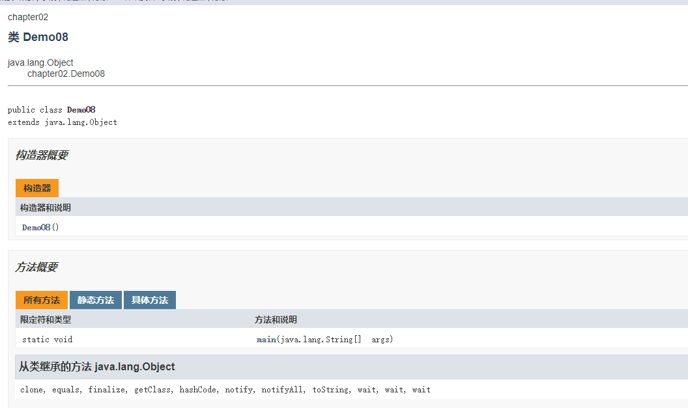

# 1.类与对象

## 1.1.类概述

**概念**

1. 类：模板、蓝图
   - behavior 行为
   - state 状态
   - identity 标识

2. 对象：类的实例

3. 类的产生是为了**封装/encapsulation/数据隐藏**

4. 类的关系
   1. 依赖 use-a
   2. 聚合 has-a
   3. 继承 is-a 

   > 这个很高层。UML的标准更具体，还有组合、关联、继承、实现

5. 构造器/构造函数

6. 访问权限

| 同一个类  | **同一个包** | **不同包的子类** | **不同包的非子类** |      |
| --------- | ------------ | ---------------- | ------------------ | ---- |
| Private   | √            |                  |                    |      |
| Default   | √            | √                |                    |      |
| Protected | √            | √                | √                  |      |
| Public    | √            | √                | √                  | √    |

7. final声明的字段必须在构造器里赋值

8. 静态方法、静态字段。类共享一份

9. 方法参数

   - 按值调用 call by value 基本类型，无法修改在外部传入时的值

   - 引用调用 reference 可以修改外部传入的类的内容。

     > 注意和c++的不同，引用不等于指针。 x y 传入进来后 相当于 newx，newy。  修改newx的引用值，不会对外部x产生影响。
     >
     > String 不可变对象。所以reference的方式传也是无法直接修改的。每次修改实际都是产生一个新的String，来保证对外部不会产生影响

**补充**

1. JAVA10引入：使用var来声明对象，自动检测类型。不适用于数值类型，如int、double、long

   `var a = new String("2");`

2. 快速判断null值

   ```java
   test = Objects.requireNonNullElse(n,"unknown"); //没有就赋值默认值
   test = Objects.requireNonNull(n,"test cannot be null"); //抛异常
   //空指针的传递很可能导致追踪困难，这种写法可以轻易追踪到具体null的位置
   ```

3. 每个方法的第一个参数都是隐式参数this，指向对象本身（JVM笔记里有提到）

4. 贫血模型不要在get set里惨杂业务逻辑，充血模型可以考虑，不必局限与字段一一对应

   ```java
   //充血模型的例子
   String firstname;
   String lastname;
   ....
   public String getName(){
       return firstname + " " + lastname;
   }
   ```

## 1.2.对象构造

**重载**

可以声明相同名字不同参数的方法

>  java的标准中没有将返回值纳入函数签名, 所以只有返回值不同是无法区分不同的方法的。
>
> 函数签名实习和JVM有关，具体看jvm详解构造

**默认无参构造器**

没写构造函数的时候默认会有，写了这个就没了。

**字段初始化**

1. `int a;`默认字段初始化。比如int默认赋0，引用类型默认赋null。
2. 显示字段初始化：直接赋值/构造函数/静态方法赋值。
3. 通过this调用其他构造函数，一种设计方法。来方便逐层设计重载的构造函数

**初始化块**

每次初始化都会执行的代码

```java
{
    id = 10;
}
//建议放在字段构造块前
```

**构造器初始化顺序**

1. this 如果构造器第一行调用了其他构造函数，则执行这个调用构造器.
2. 如果第一行不是其他构造函数，执行默认字段初始化
3. 执行显示字段初始化（直接赋值、静态方法赋值）和初始化块方法
4. 最后再执行构造器主体内容

**静态初始化块**

用于静态变量的赋值，区别与普通初始化，他只有类第一次加载的时候才会执行。

```java
public static int i;
static
{
    i = 3;
}
```

## 1.3 包

**导入**

- 导入 import java.util.Collections;
- 静态导入 import java.util.*;

- 直接用 java.time.LocalDate d;

**类路径**

找jar位置，根据package路径找到具体的class文件

unix 用 : 分隔路径 windows 用 ; 分隔路径

```java
java -classpath c:\classdir;.;d:\archive.jar
```

**jar打包**

>  一般不会手动打了，用到再查吧 跳过

## 1.4 文档注释

javadoc工具，可以自动生成HTML文档

**类注释**

```java
/**
 * 注释说清楚内容
 * 可以{@code ..}来链接到具体类
 * 还可以用<em>..</em>
 */
class A{
    
}
```

**方法注释**

```java
/**
 * 注释说清楚内容
 * @param a
 * @return 
 * @throw
 */
public String t(int a) throw XXXException{
    
}
```

**字段注释**

```java
/**
 * 注释说清楚内容
 */
private int i;
```

**通用注释**

```java
@since
@author
@version
@see class
@see class#method(param) 
@see <a href="www.test.com">example</a> 
```

**包注释**

第一种方式 包下创建 package-info.java

```
/**
 * 形式是一个javadoc注释和包路径，不能再有额外的代码和注释了。在这里说清楚包作用
 */
package com.example.test;
```

第二种方式 包下创建一个package.html文件 `<body>注释的内容</body>` 会抽取body的文本作为注释

**生成javadoc文档（不重要）**

javadoc -d docDirectory nameOfPackage

> 更多方式自己去查吧
>
> 我们平时阅读源码的api文档就是javadoc文档
>
> 界面如下



## 1.5 类设计技巧

**一定保证数据私有，封装性**

- private

**一定要对数据进行初始化**

- 虽然jvm提供默认数据初始化，但最好显示指定，确保所有默认数据在自己控制之下

**不要过多的使用基本类型**

- 字段可以封装成一个小类，比如 street city state可以封装成 Address一个类作为字段

**分解过多指责的类**

**类名、方法名体现指责，别偷懒写法**

**优先使用不可变的类**

- 防止可能存在的并发问题。比如用LocalDate 不用 Data

# 2.继承

## 2.1 继承概述

**继承是is-a的关系**

- 超super 子sub 类似数学集合超集子集的概念

**继承extends与重写override**

```java
class Father{
    private int f;
    public void setF(int i){
        f = i;
    }
}
class Son extends Father{
    private int s;
   	
    @Override //重写方法
    public void setF(int i){
        //子类访问父类私有字段，和外部类访问一样，需要父类对外开放的方法
        super.setF(i);
    }
}
```

**子类构造器**

```java
class Father{
    private int f;
    public Father(int i){
        f = i;
    }
}
class Son extends Father{
    public Son(int i){
        super(i);//子类的无法访问父类的私有字段，只能用调用父类构造器的形式来调用
        //如果第一行没有显式指定super 默认会调服务的无参构造器，如果此时父类没有无参构造器，会报错
    }
}
```

**继承链**

从某特定的类到其祖先的路径称为该类的继承链

java不支持类的多继承，支持接口的多继承

继承关系像树一样

**阻止继承**

final类 不能extends了

final方法 子类无法继承这个方法

**抽象类 abstract**

不能被实例化

有抽象方法必须是抽象类

抽象类可以有具体方法

**protected**

将字段和方法仅开放给子类

## 2.2 多态

**一个对象变量可以指示多种实际类型的现象称为多态polymorphism**

- 也作一个声明为父类的地方，总可以被其子类替换（里氏替换原则）

- jvm可以知道实际变量指向的对象，可以判断变量是哪个子类或者就是父类

**数组的多态注意事项**

 ```
Son[] a = ...;
Father[] b = a;//多态，b实际上还是Son类型的数组
b[0] = new Father(...);//ArrayStoreException，Son不能被Father替换
//所以要牢记数组的真实类型
 ```

**强制类型转换**

- 父类转之类失败会有异常终止 ClassCastException，程序结束

- 使用 instance of 判断是否可以转换时良好的编程习惯

  ```java
  if(staff[1] instance of Manager){
      boss = (Manager) staff[1];
  }
  ```

## 2.3 Object

**所有类的超类**

**equals方法判断两个类是否相同**

- 重写此方法可以实现自己的equal逻辑

- 子类定义equals，可以先super调用父类的equals，因为父类不相等子类不相等（除非特殊的业务逻辑）

> Arrays.equals 快速判断数组equals

**equals的困境**

- 对称性的要求 x.equals(y) = y.equals(s) 
- 对称性判断的两种实现
  - 子类有自己的相等性概念 getClass + 额外的业务逻辑
  - 超类决定相等性概念就用  x instanceOf 父类 可以在不同的子类的判断

**hashcode**

- obeject默认的hashcode是根据存储地址计算（同一个字符串的引用的hashcode可能相同，同一个常类）
- String默认对每一个字符 31 * hash + charAt(i) 循环 计算除hashcode
- **hashcode必须与equals兼容，equals为true的hashcode必须相等（反之不对）**

> Arrays.hashcode 计算数组hashcode，为所有数组项的hashcode组成

**toString**

- 没啥说的，形成字符串

**getName**

**getClass**